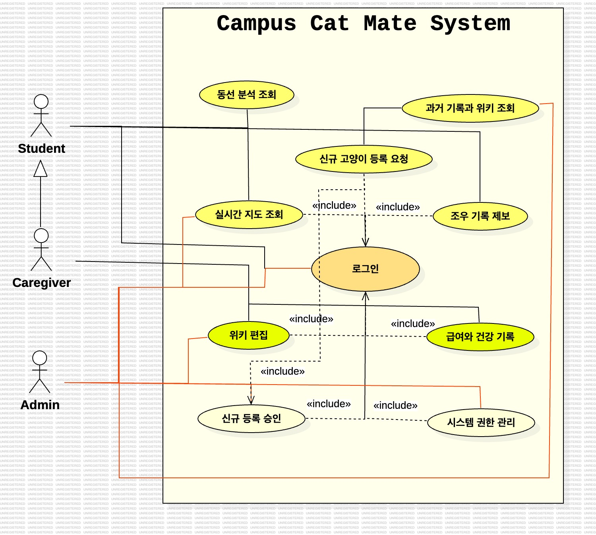

# 2. Analysis (프로젝트 분석서)

## Project Title
# 캠퍼스 냥이 메이트 (Campus Cat Mate)

## Logo
(프로젝트 로고 삽입)

---

## Student Information

- **Student No:** 22411841
- **Name:** 박다래
- **E-mail:** ret7258@naver.com

---

# Revision History

| Revision Date | Version | Description | Author |
|---|---|---|---|
| 03/27/2026 | 1.00 | First Draft | 박다래 |
| 03/27/2026 | 1.10 | Refined Actor Roles (Student, Caregiver, Admin) | 박다래 |
| 03/28/2026 | 1.11 | Refined diagrams and glossary | 박다래 |
| 03/28/2026 | 1.12 | Added Real-time Map features and refined documentation | 박다래 |
| 03/28/2026 | 1.13 | Refined project logo | 박다래 |
| 03/28/2026 | 1.20 | Integrated Predictive Location & Path Analysis Logic | 박다래 |

---

# Contents

1. Introduction  
2. Use case analysis  
3. Domain analysis  
4. User Interface prototype  
5. Glossary  
6. References  

---

# 1. Introduction

캠퍼스 냥이 메이트 (Campus Cat Mate)는 캠퍼스 내 길고양이와 학생 및 구성원이 더욱 건강하게 공존할 수 있는 환경을 제공하기 위해 기획된 체계적인 돌봄 네트워크 구축 프로젝트입니다. 본 프로젝트의 유용성과 주요 특징은 다음과 같습니다.

## 주요 특징

### 실시간 위치 분석 및 시각화
일반 학생들이 제보한 데이터를 기반으로 고양이의 현재 위치와 예상 동선을 실시간 지도(Real-time Map)로 시각화하여 학생들에게 유용한 즐거움을 제공합니다.

### 중복 급여 방지 및 전문적 건강 관리
주기적으로 돌보는 인증된 사용자(Caregiver/Guardian)에게 전용 권한을 부여하여, 사료 급여 현황과 건강 상태를 체계적으로 기록하고 중복 급여를 방지합니다.

### 지능형 식별 알고리즘
사용자의 위치와 고양이의 활동 영역(Territory)을 대조하여 개체를 추천함으로써 제보 데이터의 정확성을 높이고 지속적인 확장이 가능한 생태계 데이터를 형성합니다.

---

# 2. Use Case Analysis

## 2.1 Use Case Diagram

  

---

## 2.2 Use Case Descriptions

### Login
- **Actors:** All (Student, Caregiver, Admin)
- **Description:** 등록된 계정을 사용하여 시스템에 로그인하여 개인 세션을 획득하고 유지한다.

### Encounter Check
- **Actors:** Student, Caregiver
- **Description:** 고양이를 발견한 위치/시간을 제보하며, 영역 기반 식별 알고리즘을 통해 후보 개체를 추천받아 기록을 확정한다.

### Request Cat Reg.
- **Actors:** Student, Caregiver
- **Description:** 캠퍼스 내 미등록 고양이 발견 시 사진, 특징, 발견 위치를 첨부하여 관리자 승인 큐(Approval Queue)에 등록을 요청한다.

### Approve Cat Reg.
- **Actors:** Admin
- **Description:** 이용자들의 신규 고양이 등록 요청 건을 검토하여 공식 데이터로 승인 및 등록을 완료한다.

### Diet Check
- **Actors:** Caregiver
- **Description:** 급여한 사료의 종류, 양 및 건강 특이사항을 기록하여 중복 급여 방지 및 건강 모니터링 데이터를 생성한다.

### Wiki Edit
- **Actors:** Caregiver, Admin
- **Description:** 고양이의 특징, 건강 상태, 이름 유래 및 주요 활동 영역(Territory) 정보를 최신 상태로 업데이트한다.

### History View
- **Actors:** All
- **Description:** 위키 내용의 과거 수정 이력을 조회하여 데이터의 신뢰성을 확인하고 악의적인 수정을 모니터링한다.

### Real-time Map View
- **Actors:** All
- **Description:** 최근 제보 데이터와 최근 제보 가중치(Recency Weight)가 적용된 고양이별 실시간 예상 위치를 지도상에서 확인한다.

### Path Analysis View
- **Actors:** Student, Caregiver
- **Description:** 시간대별 루틴에 따라 고양이가 이동할 가능성이 높은 예상 동선(Predicted Path) 분석 결과를 확인한다.

---

# 3. Domain Analysis

## 3.1 Domain Classes

### Student
- **Meaning:** 위치 제보 및 신규 고양이 등록 요청이 가능한 일반 학생 사용자.

### Caregiver
- **Meaning:** 사료 급여 및 고양이 건강 상태 모니터링, 위키 편집 권한을 가진 인증된 사용자.

### Admin
- **Meaning:** 시스템 전체 관리 및 사용자 권한 부여, 신규 고양이 등록 승인 권한을 가진 관리자.

### Cat
- **Meaning:** 캠퍼스 내에서 관리되는 개별 길고양이 객체.

### Encounter Log
- **Meaning:** 사용자가 고양이를 목격하고 시스템에 전송한 조우 기록.

### Diet Log
- **Meaning:** 돌보미가 작성한 사료 급여 및 건강 모니터링 기록.

### Territory
- **Meaning:** 특정 고양이가 주로 활동하며 방어하는 캠퍼스 내 지리적 범위.

### Routine Data
- **Meaning:** 특정 고양이의 시간대별 활동 패턴을 수치화한 기초 데이터.

---

# 4. User Interface Prototype

다음은 본 시스템의 주요 화면에 대한 프로토타입입니다.

---

## 4.1 Real-time Map Screen (메인 지도 화면)

### 목적
고양이의 현재 예상 위치와 제보 현황을 지도상에서 제공.

### 화면 구성
- 상단: 검색창 및 고양이 리스트 필터
- 중앙: 고양이 예상 위치 및 실시간 이동 동선이 표시된 지도 (Google Maps 연동)
- 하단: 선택한 고양이의 간략한 프로필 카드 및 제보하기 버튼

---

## 4.2 Encounter Check Screen (제보하기 화면)

### 목적
사용자가 고양이를 발견했을 때 빠르게 제보하기 위한 화면.

### 화면 구성
- 카메라 아이콘: 사진 촬영 및 업로드 버튼
- 위치 자동 입력: 현재 GPS 좌표 확인 및 영역 기반 식별 추천  
  - 예시: `"이 근처에 사는 '치즈'인가요?"`
- 등록 요청: 신규 고양이일 경우 추가 정보 입력 필드

---

## 4.3 Caregiver Management Screen (돌보미 기록 화면)

### 목적
돌보미(Caregiver)가 사료 급여와 건강 특이사항을 기록하는 화면.

### 화면 구성
- 사료 종류 선택: 드롭다운 메뉴 (건식, 습식 등)
- 급여량 입력: 섭취량 체크박스 및 메모란
- 건강 특이사항: 이상 징후 체크 리스트 및 사진 첨부 공간

---

# 5. Glossary

| Term | Definition |
|---|---|
| Real-time Map (실시간 지도) | 최근 수집된 조우 기록을 기반으로 고양이들의 현재 위치와 예상 동선을 지도 인터페이스상에 시각화하여 보여주는 기능 |
| Path Analysis | 루틴 데이터를 기반으로 고양이의 이동 흐름을 화살표나 경로로 예측하여 보여주는 기능 |
| Encounter Check (조우 기록) | 사용자가 캠퍼스 내에서 고양이를 발견한 위치와 시간을 시스템에 제보하는 행위. 제보 시 영역 기반 식별 알고리즘을 통해 해당 개체를 추천한다 |
| Student (Observer) | 위치 제보 및 신규 고양이 등록 요청이 가능한 일반 사용자 |
| Caregiver (Guardian) | 등록 요청 및 전문 돌봄 기록(식단, 건강) 권한을 가진 인증된 사용자 |
| Territory (영역) | 특정 고양이가 주로 활동하며 방어하는 캠퍼스 내 지리적 범위 |
| Territory-based ID | 현재 위치와 영역 데이터를 대조하여 개체를 자동 판별 및 추천하는 알고리즘 |
| Approval Queue (승인 큐) | 일반 사용자가 요청한 신규 고양이 등록 건이 관리자의 최종 승인을 받기 전까지 임시로 머무르는 대기열 상태 |
| Append-only Log | 데이터 수정 시 기존 데이터를 지우지 않고 새로운 기록을 덧붙여 모든 변경 이력을 추적할 수 있게 하는 기록 방식 |
| Offline Buffering | 네트워크 단절 시 데이터를 임시 저장했다가 연결 시 자동 전송하는 기술 |
| Optimistic Locking (낙관적 락) | 여러 사용자가 동시에 데이터를 수정할 때 충돌을 방지하기 위해 버전 정보를 확인하는 관리 기법 |
| Recency Weight (최근 제보 가중치) | 예측 모델에서 과거의 통계 데이터보다 최근(예: 1시간 이내)에 발생한 실제 제보 데이터에 더 높은 우선순위를 두어 실시간 위치를 보정하는 계산 방식 |
| Diet Check (급여 기록) | Caregiver가 고양이에게 제공한 사료의 종류, 양, 시간을 기록하는 행위. 중복 급여를 방지하는 핵심 데이터로 활용됨 |
| Routine Data (루틴 데이터) | 특정 고양이가 시간대별, 요일별로 반복적으로 머무르는 장소와 활동 패턴을 수치화한 기초 데이터 |

---

# 6. References

- **Ref-1:** 에브리타임 (Everytime) - 캠퍼스 커뮤니티 내 고양이 정보 공유 니즈 및 사용자 패턴 분석.
- **Ref-2:** 동물권행동 카라 (KARA) - 대학 길고양이 돌봄 가이드라인 : 체계적 모니터링 및 영역 관리 근거.
- **Ref-3:** Google Maps API - 캠퍼스 내 정확한 위치 태깅 및 영역 시각화를 위한 기술 문서.
- **Ref-4:** OpenWeatherMap API - 기상 상황에 따른 활동 패턴 및 영역 이동 보정용 데이터 수집.
- **Ref-5:** Home Range of Free-Roaming Cats - 고양이의 지리적 영역 점유 및 행동 반경 연구.
- **Ref-6:** Applied Animal Behaviour Science - 환경 변화에 따른 고양이의 활동 루틴 연구.