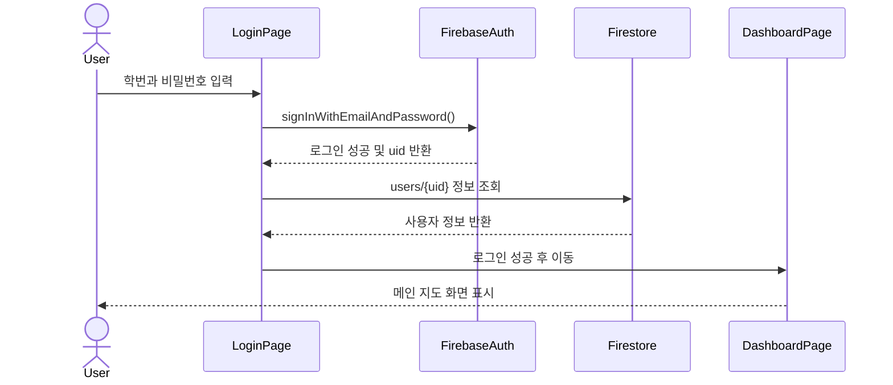
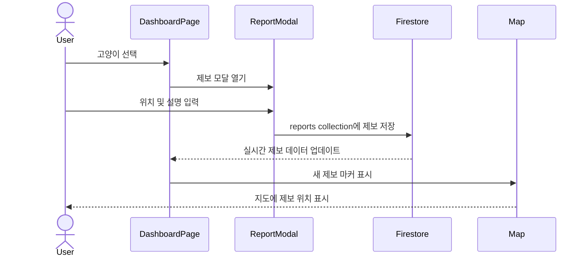
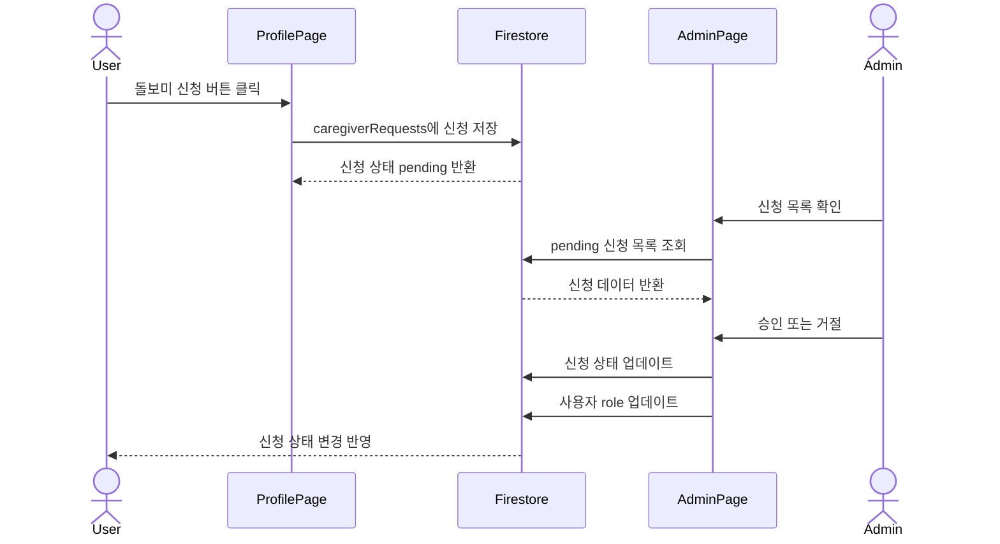
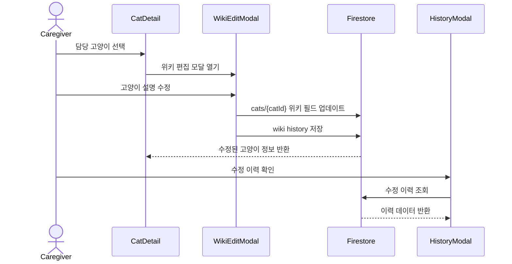
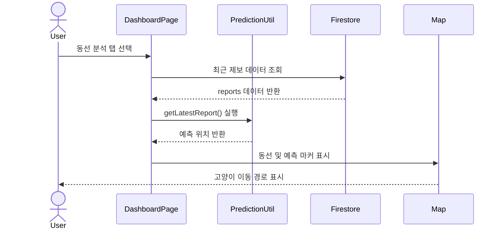
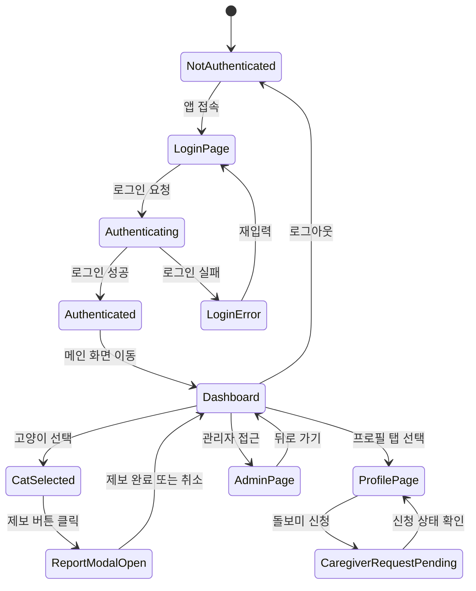
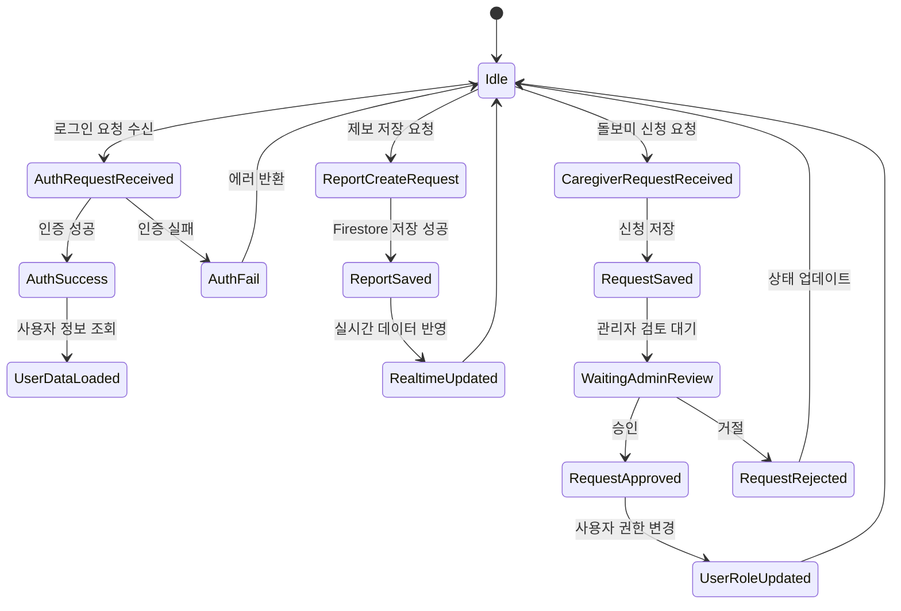

# 3. Design

## Project Title

CCM(Campus Cat Management)  
캠퍼스 고양이 제보 및 돌봄 관리 시스템

**Student No:** 22411841

**Name:** 박다래

**E-mail:** ret7258@naver.com

---

## Revision History

| Revision date | Version # | Description | Author |
| --- | ---: | --- | --- |
| 06/04/2026 | 0.01 | Initial design document 작성 | 박다래 |

---

## Contents

1. [Introduction](#1-introduction)
2. [Class Diagram](#2-class-diagram)
3. [Sequence Diagram](#3-sequence-diagram)
4. [State Machine Diagram](#4-state-machine-diagram)
5. [Implementation Requirements](#5-implementation-requirements)
6. [Glossary](#6-glossary)
7. [References](#7-references)

---

# 1. Introduction

본 문서는 CCM(Campus Cat Management) 시스템의 설계 내용을 설명한다.  
CCM은 캠퍼스 내 고양이의 위치, 상태, 급식 여부, 제보 기록 등을 관리하기 위한 웹 기반 서비스이다. 일반 학생 사용자는 캠퍼스 고양이를 조회하고 위치를 제보할 수 있으며, 돌보미 사용자는 담당 고양이의 상태와 위키 정보를 관리할 수 있다. 관리자는 돌보미 신청을 승인하거나 거절하고, 전체 사용자 및 고양이 데이터를 관리할 수 있다.

본 시스템의 주요 설계 포인트는 다음과 같다.

- 사용자 역할을 일반 학생, 돌보미, 관리자로 구분한다.
- 지도 기반 UI를 통해 고양이 위치와 제보 데이터를 시각적으로 확인한다.
- Firebase Authentication을 이용하여 로그인 및 회원가입을 처리한다.
- Firestore를 이용하여 고양이, 제보, 사용자, 돌보미 신청 데이터를 저장한다.
- 최근 제보 데이터를 기반으로 고양이의 동선을 표시한다.
- 날씨 정보와 쉼터 정보를 함께 제공하여 고양이 돌봄에 필요한 정보를 보조한다.
- React 컴포넌트 구조를 기반으로 UI와 기능을 분리하여 유지보수성을 높인다.

---

# 2. Class Diagram

## 2.1 Class Diagram

```mermaid
classDiagram
    class App {
        +App()
    }

    class AppRoutes {
        -User user
        -Boolean loading
        -Boolean isAuthenticatedUser
        +AppRoutes()
    }

    class LoginPage {
        +LoginPage(setUser)
    }

    class SignupPage {
        +SignupPage(setUser)
    }

    class DashboardPage {
        -Array cats
        -Array reports
        -Array shelters
        -String selectedCatId
        -Object clickedCoords
        -Weather weather
        -Boolean isRain
        +DashboardPage(user, setUser)
        +createCurvedRoutePath(points)
        +createRouteTimeLabel(data)
        +createPredictionLabel()
        +createMarkerImage(options)
        +createPredictionMarkerImage(size)
        +createCatMarkerElement(options)
        +handleAddReport(reportData)
        +handleSaveWiki(formData)
        +handleLogout()
        +handleReportClick(cat)
        +moveMapToCat(cat)
        +handleNavigationSelect(itemId)
    }

    class ProfilePage {
        -User user
        -Array caregiverRequests
        +ProfilePage(user, setUser)
        +handleModeSwitch()
        +handleLogout()
    }

    class CaregiverApplicationPage {
        -Array cats
        -Array selectedCatIds
        -String reason
        -String authCode
        +CaregiverApplicationPage(user)
        +toggleCat(catId)
        +handleSubmit(event)
    }

    class DietHealthRecordPage {
        -Cat cat
        -String foodType
        -String amount
        -Array symptoms
        -String memo
        +DietHealthRecordPage(user)
        +fetchCat()
        +toggleSymptom(symptom)
        +handleSave()
    }

    class AdminPage {
        -Array cats
        -Array reports
        -Array users
        -Array requests
        -Array catRequests
        +AdminPage()
        +handleApprove(request)
        +handleReject(request)
        +handleApproveCat(request)
        +handleRejectCat(request)
        +handleLogout()
    }

    class AdminUserManagementPage {
        -Array users
        +AdminUserManagementPage()
        +handleRoleChange(userId, role)
    }

    class AdminCatManagementPage {
        -Array cats
        -String keyword
        +AdminCatManagementPage()
        +handleToggleStatus(cat)
    }

    class MapContainer {
        +MapContainer(isReady, ref)
        +String displayName$
    }

    class ReportModal {
        -String selectedReportCatId
        -String memo
        -String reportImageUrl
        -Date observedAt
        -Boolean showNewCatForm
        +ReportModal(props)
        +getCurrentInputTime()
        +handleFormSubmit(event)
        +handleRequestCatRegistration()
    }

    class WikiEditForm {
        -String origin
        -String feature
        -String healthStatus
        -String territory
        +WikiEditForm(cat, onClose, onSave)
    }

    class WikiEditModal {
        +WikiEditModal(isOpen, cat, onClose, onSave)
    }

    class HistoryModal {
        -Array histories
        +HistoryModal(isOpen, cat, user, onClose)
        +updateHistories()
        +formatTime(timestamp)
    }

    class useCats {
        -Array cats
        +useCats()
    }

    class useReports {
        -Array reports
        +useReports()
    }

    class useShelters {
        -Array shelters
        +useShelters()
    }

    class useWeather {
        -Weather weather
        -Boolean weatherLoading
        -Boolean isRain
        +useWeather()
        +fetchWeather()
    }

    class useCatPrediction {
        -Cat currentSelectedCat
        -Object predictedLocation
        -Number reportCount
        -Report latestReport
        -Shelter nearestShelter
        +useCatPrediction(params)
    }

    class catService {
        +subscribeCats(callback)$
        +getCat(catId)$
        +updateCat(catId, data)$
        +updateCatWiki(catId, formData)$
        +createCatFromRegistrationRequest(request)$
    }

    class reportService {
        +subscribeReports(callback)$
        +createReport(data)$
    }

    class caregiverRequestService {
        +subscribePendingCaregiverRequests(callback)$
        +createCaregiverRequest(data)$
        +approveCaregiverRequest(requestId)$
        +rejectCaregiverRequest(requestId)$
    }

    class catRegistrationService {
        +subscribePendingCatRegistrationRequests(callback)$
        +createCatRegistrationRequest(data)$
        +approveCatRegistrationRequest(requestId)$
        +rejectCatRegistrationRequest(requestId)$
    }

    class dietLogService {
        +createDietLog(data)$
        +subscribeLatestDietLog(callback)$
    }

    class userService {
        +subscribeUsers(callback)$
        +approveCaregiverUser(uid, catIds)$
    }

    class shelterService {
        +subscribeShelters(callback)$
    }

    class wikiService {
        +createWikiHistory(data)$
    }

    class snapshot {
        +mapSnapshotDocs(snapshot)$
    }

    class User {
        +String uid
        +String studentId
        +String phone
        +String email
        +String nickname
        +String department
        +String role
        +String activeMode
        +Array caregiverCatIds
        +Timestamp createdAt
        +getUid()
        +getStudentId()
        +getPhone()
        +getEmail()
        +getNickname()
        +getDepartment()
        +getRole()
        +getActiveMode()
        +getCaregiverCatIds()
        +getCreatedAt()
        +setPhone(phone)
        +setNickname(nickname)
        +setDepartment(department)
        +setRole(role)
        +setActiveMode(activeMode)
        +setCaregiverCatIds(caregiverCatIds)
    }

    class Cat {
        +String id
        +String name
        +String gender
        +String imageUrl
        +String description
        +String origin
        +String feature
        +String healthStatus
        +String territory
        +Number lat
        +Number lng
        +String location
        +String status
        +Timestamp createdAt
        +getId()
        +getName()
        +getGender()
        +getImageUrl()
        +getDescription()
        +getOrigin()
        +getFeature()
        +getHealthStatus()
        +getTerritory()
        +getLat()
        +getLng()
        +getLocation()
        +getStatus()
        +getCreatedAt()
        +setName(name)
        +setGender(gender)
        +setImageUrl(imageUrl)
        +setDescription(description)
        +setOrigin(origin)
        +setFeature(feature)
        +setHealthStatus(healthStatus)
        +setTerritory(territory)
        +setLat(lat)
        +setLng(lng)
        +setLocation(location)
        +setStatus(status)
    }

    class Report {
        +String id
        +String catId
        +Number lat
        +Number lng
        +String memo
        +String imageUrl
        +String reporterUid
        +String reporterName
        +Timestamp observedAt
        +Timestamp createdAt
        +getId()
        +getCatId()
        +getLat()
        +getLng()
        +getMemo()
        +getImageUrl()
        +getReporterUid()
        +getReporterName()
        +getObservedAt()
        +getCreatedAt()
        +setCatId(catId)
        +setLat(lat)
        +setLng(lng)
        +setMemo(memo)
        +setImageUrl(imageUrl)
        +setReporterUid(reporterUid)
        +setReporterName(reporterName)
        +setObservedAt(observedAt)
    }

    class DietLog {
        +String id
        +String catId
        +String catName
        +String caregiverUid
        +String caregiverName
        +String foodType
        +String amount
        +Array symptoms
        +String memo
        +Timestamp fedAt
        +getId()
        +getCatId()
        +getCatName()
        +getCaregiverUid()
        +getCaregiverName()
        +getFoodType()
        +getAmount()
        +getSymptoms()
        +getMemo()
        +getFedAt()
        +setFoodType(foodType)
        +setAmount(amount)
        +setSymptoms(symptoms)
        +setMemo(memo)
    }

    class WikiHistory {
        +String id
        +String catId
        +String editorUid
        +String editorName
        +String origin
        +String feature
        +String healthStatus
        +String territory
        +Timestamp editedAt
        +getId()
        +getCatId()
        +getEditorUid()
        +getEditorName()
        +getOrigin()
        +getFeature()
        +getHealthStatus()
        +getTerritory()
        +getEditedAt()
        +setOrigin(origin)
        +setFeature(feature)
        +setHealthStatus(healthStatus)
        +setTerritory(territory)
    }

    class CaregiverRequest {
        +String id
        +String uid
        +String studentId
        +String nickname
        +Array catIds
        +String reason
        +String authCode
        +String status
        +Timestamp createdAt
        +Timestamp approvedAt
        +Timestamp rejectedAt
        +getId()
        +getUid()
        +getStudentId()
        +getNickname()
        +getCatIds()
        +getReason()
        +getAuthCode()
        +getStatus()
        +getCreatedAt()
        +getApprovedAt()
        +getRejectedAt()
        +setCatIds(catIds)
        +setReason(reason)
        +setAuthCode(authCode)
        +setStatus(status)
    }

    class CatRegistrationRequest {
        +String id
        +String tempName
        +String gender
        +String description
        +String requesterUid
        +String requesterName
        +Number lat
        +Number lng
        +Timestamp observedAt
        +String status
        +Timestamp createdAt
        +Timestamp approvedAt
        +Timestamp rejectedAt
        +getId()
        +getTempName()
        +getGender()
        +getDescription()
        +getRequesterUid()
        +getRequesterName()
        +getLat()
        +getLng()
        +getObservedAt()
        +getStatus()
        +getCreatedAt()
        +getApprovedAt()
        +getRejectedAt()
        +setTempName(tempName)
        +setGender(gender)
        +setDescription(description)
        +setLat(lat)
        +setLng(lng)
        +setObservedAt(observedAt)
        +setStatus(status)
    }

    class Shelter {
        +String id
        +String name
        +Number lat
        +Number lng
        +String location
        +String description
        +getId()
        +getName()
        +getLat()
        +getLng()
        +getLocation()
        +getDescription()
        +setName(name)
        +setLat(lat)
        +setLng(lng)
        +setLocation(location)
        +setDescription(description)
    }

    class Weather {
        +String main
        +String description
        +Number temperature
        +Boolean isRain
        +getMain()
        +getDescription()
        +getTemperature()
        +getIsRain()
        +setMain(main)
        +setDescription(description)
        +setTemperature(temperature)
        +setIsRain(isRain)
    }

    App --> AppRoutes
    AppRoutes --> LoginPage
    AppRoutes --> SignupPage
    AppRoutes --> DashboardPage
    AppRoutes --> ProfilePage
    AppRoutes --> CaregiverApplicationPage
    AppRoutes --> DietHealthRecordPage
    AppRoutes --> AdminPage
    AppRoutes --> User

    DashboardPage --> MapContainer
    DashboardPage --> ReportModal
    DashboardPage --> WikiEditModal
    DashboardPage --> HistoryModal
    DashboardPage --> useCats
    DashboardPage --> useReports
    DashboardPage --> useShelters
    DashboardPage --> useWeather
    DashboardPage --> useCatPrediction
    DashboardPage --> catService
    DashboardPage --> reportService
    DashboardPage --> dietLogService
    DashboardPage --> wikiService

    CaregiverApplicationPage --> useCats
    CaregiverApplicationPage --> caregiverRequestService
    DietHealthRecordPage --> catService
    DietHealthRecordPage --> dietLogService
    AdminPage --> User
    AdminPage --> Cat
    AdminPage --> Report
    AdminPage --> CaregiverRequest
    AdminPage --> CatRegistrationRequest
    AdminPage --> catService
    AdminPage --> reportService
    AdminPage --> userService
    AdminPage --> caregiverRequestService
    AdminPage --> catRegistrationService

    useCats --> catService
    useReports --> reportService
    useShelters --> shelterService
    useWeather --> Weather
    useCatPrediction --> Cat
    useCatPrediction --> Report
    useCatPrediction --> Shelter

    ReportModal --> Report
    ReportModal --> CatRegistrationRequest
    ReportModal --> catRegistrationService
    WikiEditModal --> WikiEditForm
    WikiEditModal --> WikiHistory
    HistoryModal --> DietLog
    HistoryModal --> WikiHistory
    HistoryModal --> Report
    DietHealthRecordPage --> DietLog

    catService --> Cat
    reportService --> Report
    caregiverRequestService --> CaregiverRequest
    catRegistrationService --> CatRegistrationRequest
    dietLogService --> DietLog
    userService --> User
    shelterService --> Shelter
    wikiService --> WikiHistory
    catService --> snapshot
    reportService --> snapshot
    shelterService --> snapshot
    userService --> snapshot
    caregiverRequestService --> snapshot
    catRegistrationService --> snapshot
```

---

위 Class Diagram은 실제 구현 구조에 맞추어 React 컴포넌트, custom hook, 함수형 service module, Firestore 문서 데이터를 중심으로 표현한다. CCM은 전통적인 OOP 방식의 `AuthService`, `CatService` 클래스를 두지는 않지만, `catService.js`, `reportService.js`, `caregiverRequestService.js`와 같은 함수형 service module을 통해 Firebase 호출 로직을 분리한다. Class Diagram에서는 이러한 module-level export 함수를 static operation으로 해석하여 `$` 표기를 사용하였다.

사용자 권한은 `Student`, `Caregiver`, `Admin` 클래스로 상속하지 않고, `User` 문서의 `role`과 `activeMode` 필드로 구분한다. `Cat`, `Report`, `DietLog`, `WikiHistory`, `CaregiverRequest`, `CatRegistrationRequest`, `Shelter`는 Firestore에 저장되는 핵심 데이터이며, 각 데이터 객체에는 속성 접근과 변경을 표현하기 위해 getter/setter operation을 포함하였다. 현재 구현에는 abstract class 또는 interface가 없으므로 추상 클래스와 추상 메서드는 표시하지 않았다.

각 화면 컴포넌트는 사용자 이벤트와 화면 상태를 관리하고, custom hook은 Firestore 구독 결과와 계산 결과를 React 상태로 제공한다. 실제 데이터 생성, 조회, 수정은 service module을 통해 수행되며, 이를 통해 화면 로직과 Firebase 접근 로직을 분리한다.

## 2.2 Class Description

### User

| Item | Description |
| --- | --- |
| Class name | User |
| Responsibility | 시스템 사용자의 기본 정보를 저장하고 역할을 관리한다. |
| Attributes | uid, studentId, phone, email, nickname, department, role, activeMode, caregiverCatIds, createdAt |
| Methods | getUid(), getRole(), getActiveMode(), getCaregiverCatIds(), setRole(), setActiveMode(), setCaregiverCatIds() |
| Related data | Firestore `users` collection |
| Description | 실제 구현에서는 별도 하위 클래스 없이 `role` 값으로 일반 학생, 돌보미, 관리자를 구분한다. 돌보미 승인 시 `caregiverCatIds`에 담당 고양이 목록이 저장된다. |

### Cat

| Item | Description |
| --- | --- |
| Class name | Cat |
| Responsibility | 캠퍼스 고양이의 기본 정보와 상태를 관리한다. |
| Attributes | id, name, gender, imageUrl, description, origin, feature, healthStatus, territory, lat, lng, location, status, createdAt |
| Methods | getId(), getName(), getLat(), getLng(), getStatus(), setName(), setOrigin(), setFeature(), setHealthStatus(), setTerritory(), setStatus() |
| Related data | Firestore `cats` collection |
| Description | 고양이 이름, 이미지, 외형 특징, 건강 상태, 활동 영역, 지도 표시용 좌표를 포함한다. 돌보미는 담당 고양이의 위키 정보를 수정할 수 있고, 관리자는 신규 고양이 등록 요청을 승인하여 공식 고양이 데이터로 추가한다. |

### Report

| Item | Description |
| --- | --- |
| Class name | Report |
| Responsibility | 사용자가 등록한 고양이 위치 제보 정보를 저장한다. |
| Attributes | id, catId, lat, lng, memo, imageUrl, reporterUid, reporterName, observedAt, createdAt |
| Methods | getId(), getCatId(), getLat(), getLng(), getMemo(), getObservedAt(), setMemo(), setImageUrl(), setObservedAt() |
| Related data | Firestore `reports` collection |
| Description | 사용자가 특정 고양이를 발견한 좌표, 메모, 이미지, 관찰 시간을 등록하면 제보 데이터로 저장된다. 최근 제보 데이터는 지도 마커와 위치 예측에 사용된다. |

### DietLog

| Item | Description |
| --- | --- |
| Class name | DietLog |
| Responsibility | 돌보미가 작성한 급여 및 건강 기록을 저장한다. |
| Attributes | id, catId, catName, caregiverUid, caregiverName, foodType, amount, symptoms, memo, fedAt |
| Methods | getId(), getCatId(), getFoodType(), getAmount(), getSymptoms(), getMemo(), getFedAt(), setFoodType(), setAmount(), setSymptoms(), setMemo() |
| Related data | Firestore `dietLogs` collection |
| Description | 담당 돌보미가 고양이에게 제공한 사료 종류, 급여량, 증상 목록, 메모를 기록한다. 기록은 히스토리 모달에서 위키 이력 및 제보 기록과 함께 조회된다. |

### WikiHistory

| Item | Description |
| --- | --- |
| Class name | WikiHistory |
| Responsibility | 고양이 위키 정보 수정 이력을 저장한다. |
| Attributes | id, catId, editorUid, editorName, origin, feature, healthStatus, territory, editedAt |
| Methods | getId(), getCatId(), getEditorUid(), getOrigin(), getFeature(), getHealthStatus(), getTerritory(), getEditedAt(), setOrigin(), setFeature(), setHealthStatus(), setTerritory() |
| Related data | Firestore `wikiHistories` collection |
| Description | 돌보미가 담당 고양이의 유래, 특징, 건강 상태, 활동 영역을 수정할 때 수정 내용을 저장한다. |

### CaregiverRequest

| Item | Description |
| --- | --- |
| Class name | CaregiverRequest |
| Responsibility | 일반 사용자의 돌보미 권한 신청 정보를 관리한다. |
| Attributes | id, uid, studentId, nickname, catIds, reason, authCode, status, createdAt, approvedAt, rejectedAt |
| Methods | getId(), getUid(), getCatIds(), getReason(), getStatus(), getCreatedAt(), setCatIds(), setReason(), setAuthCode(), setStatus() |
| Related data | Firestore `caregiverRequests` collection |
| Description | 사용자가 하나 이상의 담당 희망 고양이를 선택하여 돌보미 권한을 신청한다. 관리자가 승인하면 사용자 문서의 `role`이 `caregiver`로 변경되고 `caregiverCatIds`가 저장된다. |

### CatRegistrationRequest

| Item | Description |
| --- | --- |
| Class name | CatRegistrationRequest |
| Responsibility | 신규 고양이 등록 요청 정보를 임시 저장하고 승인 상태를 관리한다. |
| Attributes | id, tempName, gender, description, requesterUid, requesterName, lat, lng, observedAt, status, createdAt, approvedAt, rejectedAt |
| Methods | getId(), getTempName(), getGender(), getDescription(), getLat(), getLng(), getObservedAt(), getStatus(), setTempName(), setGender(), setDescription(), setStatus() |
| Related data | Firestore `catRegistrationRequests` collection |
| Description | 추천 목록에 없는 새로운 고양이를 발견했을 때 사용자가 등록 요청을 보낼 수 있다. 관리자가 승인하면 `cats` 컬렉션에 공식 고양이 문서가 생성된다. |

### Shelter

| Item | Description |
| --- | --- |
| Class name | Shelter |
| Responsibility | 고양이 쉼터 위치 정보를 관리한다. |
| Attributes | id, name, lat, lng, location, description |
| Methods | getId(), getName(), getLat(), getLng(), getLocation(), getDescription(), setName(), setLat(), setLng(), setLocation(), setDescription() |
| Related data | Firestore `shelters` collection |
| Description | 비나 악천후 상황에서 고양이가 머물 수 있는 쉼터 정보를 지도에 표시한다. |

### Weather

| Item | Description |
| --- | --- |
| Class name | Weather |
| Responsibility | 현재 날씨 정보를 제공한다. |
| Attributes | main, description, temperature, isRain |
| Methods | getMain(), getDescription(), getTemperature(), getIsRain(), setMain(), setDescription(), setTemperature(), setIsRain() |
| Related data | Weather API |
| Description | 날씨 API를 통해 현재 날씨를 가져오고, 비가 오는 경우 쉼터 정보나 주의 메시지를 제공하는 데 사용된다. |

### DashboardPage

| Item | Description |
| --- | --- |
| Class name | DashboardPage |
| Responsibility | 메인 지도 화면과 고양이 관련 기능을 통합 관리한다. |
| Attributes | cats, reports, shelters, selectedCatId, clickedCoords, weather, isRain |
| Methods | handleAddReport(), handleSaveWiki(), handleLogout(), handleReportClick(), moveMapToCat(), handleNavigationSelect() |
| Description | 고양이 목록, 지도 마커, 제보 모달, 동선 분석, 날씨 정보 등을 사용자에게 제공하는 핵심 화면이다. |

### AdminPage

| Item | Description |
| --- | --- |
| Class name | AdminPage |
| Responsibility | 관리자 기능을 제공한다. |
| Attributes | users, cats, reports, requests, catRequests |
| Methods | handleApprove(), handleReject(), handleApproveCat(), handleRejectCat(), handleLogout() |
| Description | 관리자는 돌보미 신청과 신규 고양이 등록 요청을 확인하고 승인 또는 거절할 수 있으며, 사용자와 고양이 데이터를 관리할 수 있다. |

### Custom Hooks

| Item | Description |
| --- | --- |
| Class name | useCats, useReports, useShelters, useWeather, useCatPrediction |
| Responsibility | service module 호출 결과를 React 상태로 관리하고, 날씨 API 호출 및 고양이 위치 예측 계산을 담당한다. |
| Methods | useCats(), useReports(), useShelters(), useWeather(), useCatPrediction() |
| Description | custom hook은 화면 컴포넌트가 데이터 구독 결과와 계산 결과를 쉽게 사용할 수 있도록 React 상태 형태로 감싼다. |

---

# 3. Sequence Diagram

## 3.1 Login Sequence

### Explanation

사용자는 로그인 화면에서 학번과 비밀번호를 입력한다. 시스템은 학번 뒤에 학교 이메일 도메인을 붙여 Firebase Authentication에 로그인 요청을 보낸다. 로그인이 성공하면 Firestore에서 해당 사용자의 정보를 조회하고, 사용자 역할에 따라 메인 대시보드 화면으로 이동한다.

## 3.2 Cat Report Sequence

### Explanation

사용자는 지도 또는 고양이 목록에서 고양이를 선택한 뒤 제보를 등록한다. 제보 정보는 Firestore의 `reports` 컬렉션에 저장된다. Firestore의 실시간 구독 기능을 통해 새 제보 데이터가 즉시 대시보드에 반영되며, 지도에는 제보 위치 마커가 표시된다.

## 3.3 Caregiver Request Sequence

### Explanation

일반 사용자는 프로필 화면에서 돌보미 권한을 신청할 수 있다. 신청 정보는 `caregiverRequests` 컬렉션에 pending 상태로 저장된다. 관리자는 관리자 페이지에서 신청 목록을 확인한 뒤 승인 또는 거절할 수 있다. 승인 시 사용자의 역할이 caregiver로 변경된다.

## 3.4 Cat Wiki Edit Sequence

### Explanation

돌보미는 담당 고양이의 상세 정보 화면에서 위키 설명을 수정할 수 있다. 수정된 내용은 `cats` 컬렉션에 반영되며, 동시에 수정 이력도 별도로 저장된다. 이후 사용자는 히스토리 모달을 통해 이전 수정 내역을 확인할 수 있다.

## 3.5 Route Prediction Sequence

### Explanation

사용자가 동선 분석 기능을 선택하면 시스템은 최근 제보 데이터를 기반으로 고양이의 이동 경로를 지도에 표시한다. 현재 구현에서는 최근 제보 데이터를 기준으로 동선이 생성되며, 이후에는 날짜 기준 최근 3개 제보를 정확히 사용하도록 개선이 필요하다.

---

# 4. State Machine Diagram

## 4.1 Client State Machine Diagram

### Explanation

클라이언트는 로그인 전 상태에서 시작한다. 사용자가 로그인에 성공하면 대시보드 상태로 전환된다. 대시보드에서는 고양이 선택, 제보 등록, 프로필 확인, 관리자 페이지 접근 등의 상태로 이동할 수 있다. 로그아웃하면 다시 인증되지 않은 상태로 돌아간다.

## 4.2 Server State Machine Diagram

### Explanation

서버는 Firebase Authentication과 Firestore를 중심으로 동작한다. 로그인 요청이 들어오면 인증을 수행하고, 성공 시 사용자 정보를 반환한다. 제보 등록 요청은 Firestore에 저장되고 실시간 구독을 통해 클라이언트에 반영된다. 돌보미 신청은 관리자 검토 상태로 저장되며, 승인 시 사용자 권한이 변경된다.

---

# 5. Implementation Requirements

## 5.1 Operating Environment

| Category | Requirement |
| --- | --- |
| Frontend Framework | React |
| Build Tool | Vite |
| Language | JavaScript, JSX |
| Styling | Tailwind CSS |
| Authentication | Firebase Authentication |
| Database | Cloud Firestore |
| Map API | Kakao Map API |
| Weather API | External Weather API |
| Package Manager | npm |
| Runtime Environment | Node.js |
| Browser | Chrome, Safari, Edge 등 최신 브라우저 |
| Deployment | Vercel 또는 Firebase Hosting |

## 5.2 Functional Requirements

| No. | Requirement |
| ---: | --- |
| FR-01 | 사용자는 학번과 비밀번호를 이용하여 로그인할 수 있어야 한다. |
| FR-02 | 사용자는 회원가입 시 학생 또는 돌보미 신청 정보를 입력할 수 있어야 한다. |
| FR-03 | 사용자는 지도에서 캠퍼스 고양이 위치를 확인할 수 있어야 한다. |
| FR-04 | 사용자는 고양이를 선택하여 상세 정보를 확인할 수 있어야 한다. |
| FR-05 | 사용자는 고양이 목격 위치를 제보할 수 있어야 한다. |
| FR-06 | 시스템은 제보 데이터를 지도 마커로 표시해야 한다. |
| FR-07 | 시스템은 최근 제보 데이터를 기반으로 고양이 동선을 표시해야 한다. |
| FR-08 | 돌보미는 담당 고양이의 설명과 급식 상태를 수정할 수 있어야 한다. |
| FR-09 | 돌보미는 담당 고양이의 급여 및 건강 기록을 작성할 수 있어야 한다. |
| FR-10 | 관리자는 돌보미 신청을 승인 또는 거절할 수 있어야 한다. |
| FR-11 | 관리자는 신규 고양이 등록 요청을 승인 또는 반려할 수 있어야 한다. |
| FR-12 | 시스템은 날씨 정보를 제공하고 비 오는 상황에서 쉼터 정보를 표시할 수 있어야 한다. |

## 5.3 Non-functional Requirements

| No. | Requirement |
| ---: | --- |
| NFR-01 | UI는 모바일 화면에서도 사용하기 쉬워야 한다. |
| NFR-02 | Firestore 실시간 구독을 사용하여 데이터 변경 사항을 빠르게 반영해야 한다. |
| NFR-03 | 사용자 역할에 따라 접근 가능한 기능을 제한해야 한다. |
| NFR-04 | 이미지, 지도 마커, 모달 등 UI 요소는 일관된 디자인을 가져야 한다. |
| NFR-05 | API key와 Firebase 설정 정보는 환경 변수로 관리해야 한다. |
| NFR-06 | 코드 유지보수를 위해 컴포넌트와 커스텀 훅을 분리해야 한다. |

## 5.4 Hardware Requirements

| Category | Requirement |
| --- | --- |
| Client Device | PC, 노트북, 태블릿, 스마트폰 |
| Network | 인터넷 연결 필요 |
| Server | Firebase Cloud Service 사용 |

## 5.5 Software Requirements

| Category | Requirement |
| --- | --- |
| OS | macOS, Windows, Linux |
| Browser | Chrome, Safari, Edge |
| Editor | Visual Studio Code |
| Version Control | Git, GitHub |
| Library | React Router, Firebase SDK, Lucide React, Tailwind CSS |

---

# 6. Glossary

| Term | Description |
| --- | --- |
| CCM | Campus Cat Management의 약자로, 캠퍼스 고양이 관리 시스템을 의미한다. |
| User | 시스템을 사용하는 일반 사용자, 돌보미, 관리자를 포함한다. |
| Student | 일반 학생 사용자로, 고양이 조회 및 제보 기능을 사용할 수 있다. |
| Caregiver | 고양이를 관리하는 돌보미 사용자로, 담당 고양이의 정보 수정 권한을 가진다. |
| Admin | 시스템 관리자로, 돌보미 신청 승인 및 사용자 관리를 수행한다. |
| Cat | 캠퍼스 내에서 관리 대상이 되는 고양이 객체이다. |
| Report | 사용자가 등록한 고양이 목격 제보 데이터이다. |
| DietLog | 돌보미가 작성한 고양이 급여 및 건강 기록 데이터이다. |
| WikiHistory | 고양이 위키 정보가 수정될 때 이전 내용과 수정 내용을 저장하는 이력 데이터이다. |
| CatRegistrationRequest | 신규 고양이 등록 요청을 임시 저장하고 관리자 승인 상태를 관리하는 데이터이다. |
| Shelter | 고양이가 비나 위험 상황을 피할 수 있는 쉼터 위치 정보이다. |
| Firebase Authentication | 사용자 로그인 및 회원가입 인증을 처리하는 Firebase 서비스이다. |
| Firestore | Firebase에서 제공하는 NoSQL 클라우드 데이터베이스이다. |
| Collection | Firestore에서 문서들을 그룹화하는 단위이다. |
| Document | Firestore에서 실제 데이터가 저장되는 단위이다. |
| Kakao Map API | 지도 표시 및 위치 기반 기능을 제공하는 API이다. |
| Marker | 지도 위에 특정 위치를 표시하는 아이콘이다. |
| Route Prediction | 최근 제보 데이터를 기반으로 고양이 이동 경로를 예측하거나 시각화하는 기능이다. |
| Wiki | 고양이의 설명이나 특징을 사용자가 확인하고 돌보미가 수정할 수 있는 정보 영역이다. |
| Revision History | 문서 또는 데이터가 수정된 이력을 기록한 정보이다. |
| Modal | 화면 위에 팝업 형태로 나타나는 UI 컴포넌트이다. |
| Active Mode | 사용자가 현재 사용 중인 모드로, student 또는 caregiver 모드가 있다. |

---

# 7. References

| No. | Reference |
| ---: | --- |
| 1 | React 공식 문서 |
| 2 | Firebase Authentication 공식 문서 |
| 3 | Cloud Firestore 공식 문서 |
| 4 | Vite 공식 문서 |
| 5 | Tailwind CSS 공식 문서 |
| 6 | Kakao Maps API 공식 문서 |
