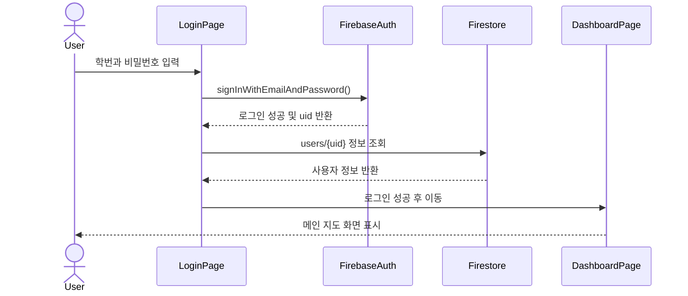
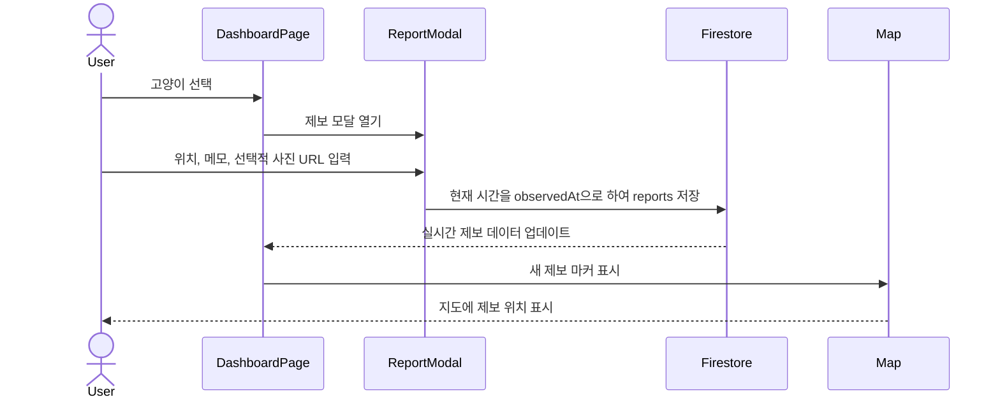
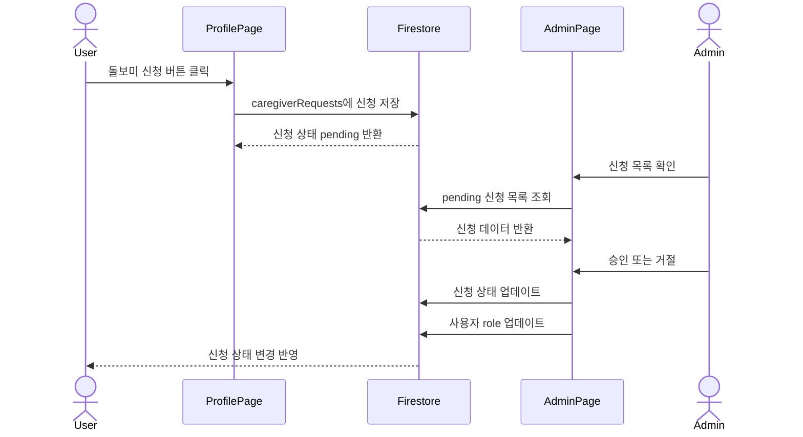
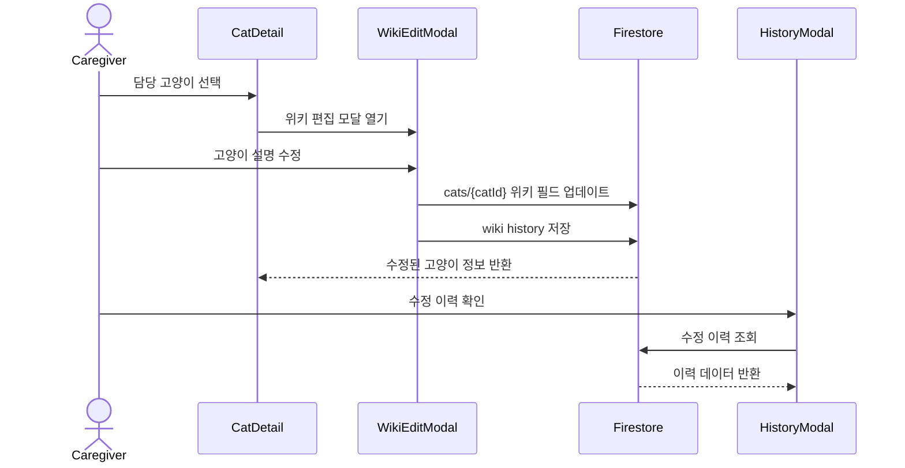
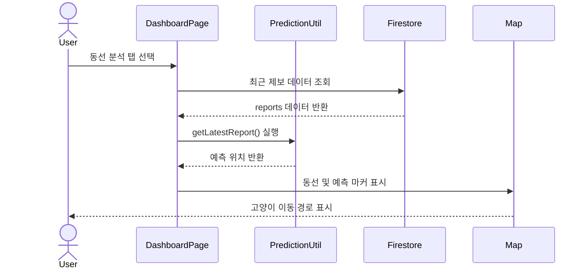
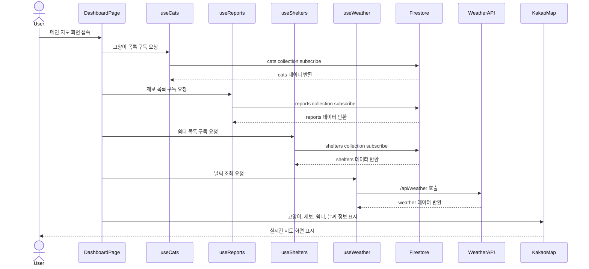
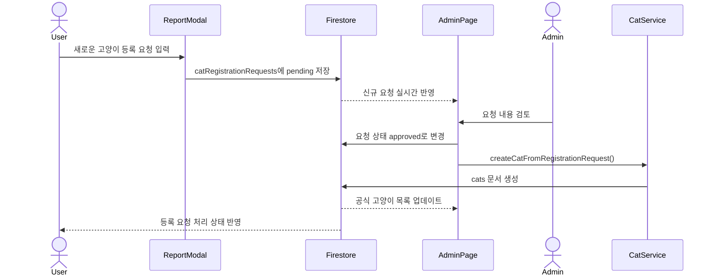
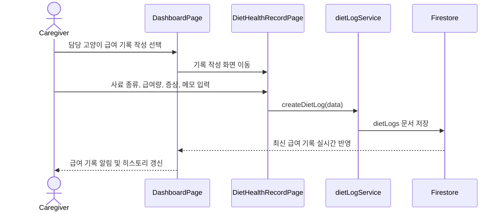
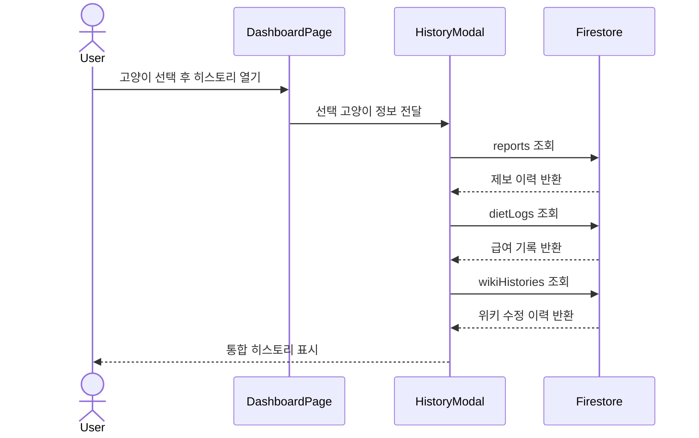
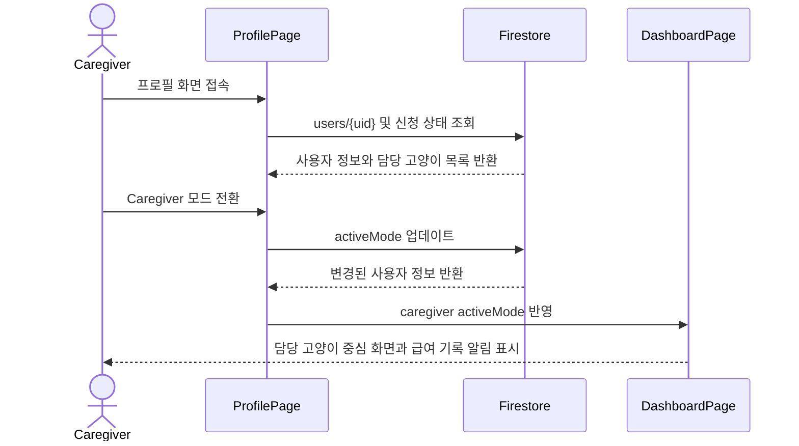

# CCM(Campus Cat Mate)

## -Design-

| Student No | 22411841 |
| --- | --- |
| Name | 박다래 |
| E-Mail | ret7258@naver.com |

---

## Revision History

| Revision date | Version # | Description | Author |
| --- | ---: | --- | --- |
| 06/04/2026 | 1.01 | Initial design document 작성 | 박다래 |
| 06/05/2026 | 1.02 |  배포 구조, 날씨 API, 제보 시간, 데이터 필드 수정 | 박다래 |

---

## Contents

| No. | Section | Description |
| ---: | --- | --- |
| 1 | [Introduction](#1-introduction) | 시스템 개요와 설계 목표 |
| 2 | [Class Diagram](#2-class-diagram) | Component, custom hook, service module, Entity 간 책임 구조 |
| 3 | [Sequence Diagram](#3-sequence-diagram) | Conceptualization 단계의 전체 use case 실현 흐름 |
| 4 | [State Machine Diagram](#4-state-machine-diagram) | 클라이언트 및 서버 상태 전이 |
| 5 | [Implementation Requirements](#5-implementation-requirements) | 구현 환경, 기능 요구사항, 비기능 요구사항 |
| 6 | [Glossary](#6-glossary) | 주요 용어 정의 |
| 7 | [References](#7-references) | 참고 문서 |

---

# 1. Introduction

본 문서는 CCM(Campus Cat Mate) 시스템의 설계 내용을 설명한다. CCM은 캠퍼스 내 길고양이의 위치, 제보 기록, 급식 여부, 건강 상태, 돌봄 정보를 하나의 서비스에서 관리하기 위한 웹 기반 시스템이다. 본 시스템은 학생들이 일상적으로 남기는 고양이 목격 기록을 유의미한 데이터로 전환하고, 이를 통해 캠퍼스 길고양이와 사람이 보다 안전하고 체계적으로 공존할 수 있는 환경을 제공하는 것을 목표로 한다.

캠퍼스 내 길고양이들은 학업에 지친 학생들에게 정서적 위안을 주는 소중한 존재이다. 많은 학생은 길에서 마주친 고양이의 사진을 찍어 커뮤니티에 공유하거나, 개인적으로 간식을 챙겨주며 고양이와 교감한다. 그러나 이러한 관심은 대부분 개인의 기억, 메신저 대화, SNS 게시글, 단편적인 사진 제보 등에 흩어져 있어 지속적으로 관리되기 어렵다. 특히 고양이의 최근 위치, 자주 머무는 구역, 급식 여부, 건강 이상 징후와 같은 정보는 실시간으로 공유되지 않으면 금방 휘발된다. 이로 인해 같은 고양이에 대한 중복 제보가 발생하거나, 이미 급여가 이루어진 고양이에게 다시 사료가 제공되는 상황이 생길 수 있다. 반대로 건강 이상이 관찰되더라도 관련 정보가 돌보미에게 늦게 전달되어 적절한 대응이 지연될 가능성도 있다.

현재 캠퍼스 고양이 돌봄은 소수의 동아리원, 고양이를 아끼는 학생들, 그리고 익명의 다수 관찰자에 의해 각자 이루어지고 있다. 이 과정에서 특정 고양이에게 사료 급여가 중복되어 비만 위험이 커지거나, 반대로 건강 이상 징후가 발견되어도 정보 공유가 늦어 방치되는 사각지대가 발생할 수 있다. 본 프로젝트는 학생들이 평소처럼 고양이를 발견하고 사진을 남기거나 위치를 제보하는 가벼운 행위가 고양이의 건강과 안전을 지키는 유효한 데이터가 될 수 있다는 생각에서 출발하였다. 사용자가 남긴 짧은 목격 기록들이 모이면 고양이의 최근 위치, 이동 흐름, 자주 머무는 장소를 파악할 수 있고, 돌보미는 이를 바탕으로 더 효율적인 관리와 돌봄을 수행할 수 있다.

CCM은 이러한 문제를 해결하기 위해 지도 기반 제보, 최근 제보 기반 동선 표시, 돌보미 권한 관리, 급여 및 건강 기록, 고양이 위키 편집 기능을 통합하여 제공한다. 일반 학생 사용자는 캠퍼스 고양이를 조회하고 목격 위치를 제보할 수 있으며, 돌보미 사용자는 담당 고양이의 급식 및 건강 상태를 기록하고 위키 정보를 수정할 수 있다. 관리자는 돌보미 신청과 신규 고양이 등록 요청을 승인하거나 거절함으로써 시스템 데이터의 신뢰성을 유지한다.

본 시스템은 단순히 고양이 정보를 저장하는 데 그치지 않고, 여러 사용자가 남긴 제보 데이터를 시간순으로 연결하여 고양이의 이동 흐름을 시각적으로 확인할 수 있도록 설계되었다. 또한 날씨 정보를 함께 제공하여 비가 오는 상황에서 쉼터 정보를 확인할 수 있도록 하며, 캠퍼스 길고양이와 사람이 보다 안전하고 건강하게 공존할 수 있는 환경을 지원한다. CCM의 주 사용자는 캠퍼스에서 고양이를 마주칠 때마다 사진이나 위치를 남기고 싶어 하는 재학생 및 교직원이며, 주기적으로 사료를 챙기고 건강 상태를 모니터링하는 학생 돌보미와 돌봄 동아리도 핵심 사용자층에 해당한다. 나아가 캠퍼스 주변에서 고양이를 발견하는 지역 주민까지 참여할 수 있도록 확장 가능성을 가진다.

본 시스템의 주요 설계 포인트는 다음과 같다.

- Component, custom hook, service module, Entity의 책임을 분리하여 화면 로직, 데이터 구독 로직, 외부 데이터 접근 로직을 명확히 한다.
- 사용자 역할을 일반 학생, 돌보미, 관리자로 구분한다.
- 지도 기반 UI를 통해 고양이 위치와 제보 데이터를 시각적으로 확인한다.
- Firebase Authentication을 이용하여 로그인 및 회원가입을 처리한다.
- Firestore를 이용하여 고양이, 제보, 사용자, 돌보미 신청 데이터를 저장한다.
- 최근 제보 데이터를 기반으로 고양이의 동선을 표시한다.
- Vercel Serverless Function(`/api/weather`)을 통해 OpenWeather 정보를 조회하고, 쉼터 정보를 함께 제공하여 고양이 돌봄에 필요한 정보를 보조한다.

## 1.1 Use Case Mapping

| Use Case ID | Use Case Name | Primary Actor | Related Design Element |
| --- | --- | --- | --- |
| UC-01 | Login / Signup | Student, Caregiver, Admin | AppRoutes, LoginPage, SignupPage, Firebase Authentication, User Entity |
| UC-02 | Real-time Map View | All users | DashboardPage, MapContainer, useCats, useReports, useShelters, Kakao Map SDK |
| UC-03 | Encounter Report | Student, Caregiver | ReportModal, reportService, Report Entity, current-time `observedAt` |
| UC-04 | New Cat Registration Request | Student, Caregiver | ReportModal, catRegistrationService, CatRegistrationRequest Entity |
| UC-05 | Caregiver Application | Student, Caregiver | CaregiverApplicationPage, caregiverRequestService, CaregiverRequest Entity |
| UC-06 | Caregiver Approval | Admin | AdminPage, userService, caregiverRequestService, User Entity |
| UC-07 | Diet & Health Record | Caregiver | DietHealthRecordPage, dietLogService, DietLog Entity |
| UC-08 | Wiki Edit | Caregiver | WikiEditModal, WikiEditForm, catService, wikiService, Cat/WikiHistory Entity |
| UC-09 | History View | All users | HistoryModal, Report/DietLog/WikiHistory Entity |
| UC-10 | Path Analysis | Student, Caregiver | DashboardPage, useCatPrediction, Report/Shelter/Weather Entity, Kakao Map overlay |
| UC-11 | Admin Data Management | Admin | AdminPage, AdminUserManagementPage, AdminCatManagementPage, service modules |

---

# 2. Class Diagram

본 프로젝트의 Class Diagram은 React와 Firebase 기반 웹 애플리케이션 구조를 객체지향 설계 관점에서 표현한다. 시스템은 사용자 입력과 화면 흐름을 제어하는 Component, 반복되는 데이터 구독 및 계산 로직을 분리하는 custom hook, Firebase 및 외부 API 접근을 담당하는 service module, Firestore에 저장되는 핵심 data model로 구성된다.

Component는 사용자의 이벤트를 받아 적절한 service module 또는 custom hook을 호출하므로 Controller 역할을 수행한다. service module은 Firebase Authentication, Firestore, Vercel Serverless Function 등 외부 시스템과의 데이터 접근을 담당하므로 Service 역할을 수행한다. `User`, `Cat`, `Report`, `DietLog`, `WikiHistory` 등의 Firestore data model은 시스템의 핵심 Entity로 설계하였다.

따라서 본 Class Diagram은 파일 구조를 단순히 나열한 것이 아니라, CCM 시스템의 주요 구성 요소가 어떤 책임을 가지며 서로 어떻게 의존하는지 표현한 설계 모델이다. 사용자 권한은 `Student`, `Caregiver`, `Admin` 상속 클래스로 분리하지 않고 `User`의 `role`, `activeMode`, `caregiverCatIds` 속성으로 구분하여 하나의 `User` Entity 안에서 관리한다.

## 2.1 Component-Service-Entity Class Diagram

FFigure 2.1은 CCM 시스템의 Component, custom hook, service module, Firestore data model 간의 관계를 나타낸다. Component는 사용자 입력과 화면 상태를 제어하고, custom hook은 반복되는 데이터 구독과 계산 로직을 분리한다. service module은 Firebase 및 외부 API 접근을 담당하며, Firestore data model은 시스템에서 관리하는 핵심 Entity를 표현한다.

본 다이어그램을 기준으로 화면 계층, 데이터 구독 및 계산 계층, 외부 데이터 접근 계층, 저장 데이터 구조를 분리하여 구현할 수 있다.

## 2.2 Class Description

Firestore data model은 시스템에서 관리하는 핵심 Entity이며, 각 Entity는 주요 속성과 해당 데이터를 처리하는 service module을 통해 관리된다. Class Description에서는 Component, custom hook, service module, Firestore data model의 책임과 주요 operation을 정리한다.

### React Components and Custom Hooks

| Class / Module | Responsibility | Main Methods and Roles |
| --- | --- | --- |
| App | 앱의 최상위 진입 컴포넌트이다. | App(): 라우터 기반 앱을 렌더링한다. |
| AppRoutes | 인증 상태를 구독하고 사용자 role에 따라 화면 접근을 제어한다. | AppRoutes(): 로그인 상태와 사용자 문서를 로드한다. |
| DashboardPage | 학생/돌보미의 메인 지도 화면을 구성한다. | handleAddReport(): 제보 저장, handleSaveWiki(): 위키 저장, moveMapToCat(): 선택 고양이 위치로 지도 이동 |
| ReportModal | 목격 제보와 신규 고양이 등록 요청 입력을 처리한다. | handleFormSubmit(): 현재 시간을 observedAt으로 저장, handleRequestCatRegistration(): 신규 고양이 등록 요청 생성 |
| WikiEditModal | 고양이 위키 수정 UI를 표시한다. | WikiEditModal(): 선택 고양이의 위키 편집 폼을 연다. |
| HistoryModal | 제보, 급여 기록, 위키 이력을 조회해 보여준다. | updateHistories(): 이력 데이터 갱신, formatTime(): 시간 표시 문자열 변환 |
| ProfilePage | 사용자 정보, activeMode 전환, 돌보미 신청 상태를 표시한다. | handleModeSwitch(): 학생/돌보미 모드 전환, handleLogout(): 로그아웃 |
| CaregiverApplicationPage | 돌보미 신청 대상 고양이와 신청 사유를 입력받는다. | toggleCat(): 신청 고양이 선택/해제, handleSubmit(): 신청 저장 |
| DietHealthRecordPage | 담당 고양이의 급여 및 건강 기록을 작성한다. | fetchCat(): 고양이 조회, toggleSymptom(): 증상 선택/해제, handleSave(): 급여 기록 저장 |
| AdminPage | 돌보미 신청과 신규 고양이 등록 요청을 승인/거절한다. | handleApprove(): 돌보미 승인, handleReject(): 반려, handleApproveCat(): 신규 고양이 승인 |
| useCats | cats collection을 실시간 구독한다. | useCats(): 고양이 목록 상태를 반환한다. |
| useReports | reports collection을 실시간 구독한다. | useReports(): 제보 목록 상태를 반환한다. |
| useShelters | shelters collection을 실시간 구독한다. | useShelters(): 쉼터 목록 상태를 반환한다. |
| useWeather | `/api/weather`를 호출해 현재 날씨를 가져온다. | fetchWeather(): 날씨 요청, useWeather(): weather, loading, isRain 반환 |
| useCatPrediction | 최근 제보, 쉼터, 날씨 데이터를 기반으로 예상 위치를 계산한다. | useCatPrediction(): selectedCatId 기준 예측 위치와 최신 제보를 반환한다. |

### Function Service Modules

| Module | Responsibility | Main Methods and Roles |
| --- | --- | --- |
| catService | cats collection 조회, 수정, 신규 고양이 승인 생성을 담당한다. | subscribeCats(): 실시간 구독, getCat(): 단건 조회, updateCat(): 정보 수정, updateCatWiki(): 위키/상세 정보 동시 수정 |
| reportService | reports collection 조회와 제보 생성을 담당한다. | subscribeReports(): 실시간 구독, createReport(): 현재 시간 기준 제보 저장 |
| caregiverRequestService | 돌보미 신청 생성 및 승인 상태 변경을 담당한다. | subscribePendingCaregiverRequests(): 승인 대기 신청 구독, createCaregiverRequest(): 신청 생성, approveCaregiverRequest(): 승인, rejectCaregiverRequest(): 반려 |
| catRegistrationService | 신규 고양이 등록 요청 생성 및 승인 상태 변경을 담당한다. | subscribePendingCatRegistrationRequests(): 승인 대기 요청 구독, createCatRegistrationRequest(): 요청 생성, approveCatRegistrationRequest(): 고양이 등록 승인, rejectCatRegistrationRequest(): 반려 |
| dietLogService | 급여 및 건강 기록 저장과 최신 급여 알림 조회를 담당한다. | createDietLog(): 급여 기록 저장, subscribeLatestDietLog(): 최신 급여 기록 구독 |
| userService | 사용자 목록 조회와 돌보미 권한 부여를 담당한다. | subscribeUsers(): 사용자 구독, approveCaregiverUser(): role과 caregiverCatIds 갱신 |
| shelterService | shelters collection 조회를 담당한다. | subscribeShelters(): 쉼터 목록 실시간 구독 |
| wikiService | 위키 수정 이력 저장을 담당한다. | createWikiHistory(): wikiHistories collection에 수정 이력 저장 |
| snapshot | Firestore snapshot을 일반 객체 배열로 변환한다. | mapSnapshotDocs(): 문서 id와 data를 병합해 배열로 반환 |

### Firestore Data Models

| Data Model | Responsibility | Main Fields |
| --- | --- | --- |
| User | 사용자 기본 정보와 권한 상태를 저장한다. | uid, studentId, phone, email, nickname, department, role, activeMode, caregiverCatIds, createdAt |
| Cat | 고양이 프로필, 위키 정보, 위치, 상태를 저장한다. | id, name, gender, imageUrl, description, origin, feature, healthStatus, territory, estimatedAge, weight, lat, lng, location, status |
| Report | 고양이 목격 제보를 저장한다. | id, catId, lat, lng, memo, imageUrl, reporterUid, reporterName, observedAt, createdAt |
| DietLog | 돌보미의 급여 및 건강 기록을 저장한다. | id, catId, catName, caregiverUid, caregiverName, foodType, amount, symptoms, memo, fedAt |
| WikiHistory | 고양이 위키 수정 이력을 저장한다. | id, catId, editorUid, editorName, origin, feature, healthStatus, territory, estimatedAge, weight, editedAt |
| CaregiverRequest | 돌보미 신청과 승인 상태를 저장한다. | id, uid, studentId, nickname, catIds, reason, authCode, status, createdAt, approvedAt, rejectedAt |
| CatRegistrationRequest | 신규 고양이 등록 요청과 승인 상태를 저장한다. | id, tempName, gender, description, requesterUid, requesterName, lat, lng, observedAt, status, createdAt |
| Shelter | 쉼터 위치 정보를 저장한다. | id, name, lat, lng, location, description |
| Weather | OpenWeather 응답을 화면 표시용으로 변환한 날씨 데이터이다. | main, description, temperature, isRain |

---

# 3. Sequence Diagram

## 3.1 Login Sequence

### Description

| Item | Description |
| --- | --- |
| Summary | 사용자가 학번 또는 전화번호 기반 계정으로 로그인하고 메인 지도 화면으로 이동하는 흐름 |
| Participants | User, LoginPage, FirebaseAuth, Firestore, DashboardPage |
| Main Flow | LoginPage가 입력값을 학교 이메일 형식으로 변환한 뒤 Firebase Authentication에 인증을 요청하고, 성공 시 Firestore `users/{uid}` 문서를 조회한다. |
| Result | 사용자 역할과 activeMode가 로드되고 DashboardPage가 표시된다. |

## 3.2 Cat Report Sequence

### Description

| Item | Description |
| --- | --- |
| Summary | 사용자가 고양이 목격 위치를 제보하고 지도에 실시간으로 반영하는 흐름 |
| Participants | User, DashboardPage, ReportModal, Firestore, Map |
| Main Flow | 사용자가 지도에서 위치를 선택하고 고양이, 메모, 선택적 사진 URL을 입력하면 `reports` 컬렉션에 저장된다. |
| Result | 저장 시점의 현재 시간이 `observedAt`으로 기록되고, Firestore 실시간 구독을 통해 지도 마커와 최근 제보 정보가 갱신된다. |

## 3.3 Caregiver Request Sequence

### Description

| Item | Description |
| --- | --- |
| Summary | 일반 사용자 또는 기존 돌보미가 하나 이상의 고양이에 대해 돌보미 권한을 신청하고 관리자가 처리하는 흐름 |
| Participants | User, ProfilePage, Firestore, AdminPage, Admin |
| Main Flow | 신청 정보는 `caregiverRequests` 컬렉션에 `pending` 상태로 저장되고, 관리자는 관리자 페이지에서 승인 또는 반려한다. |
| Result | 승인 시 사용자 문서의 `role`이 `caregiver`로 변경되고 `caregiverCatIds`에 담당 고양이 목록이 저장된다. |

## 3.4 Cat Wiki Edit Sequence

### Description

| Item | Description |
| --- | --- |
| Summary | 돌보미가 담당 고양이의 위키 정보를 수정하고 수정 이력을 저장하는 흐름 |
| Participants | Caregiver, CatDetail, WikiEditModal, Firestore, HistoryModal |
| Main Flow | 담당 권한을 확인한 뒤 위키 입력값을 `cats` 문서에 업데이트하고, 수정 내용은 `wikiHistories` 컬렉션에 저장한다. |
| Result | 고양이 상세 카드와 히스토리 모달에서 최신 위키 정보 및 수정 이력을 확인할 수 있다. |

## 3.5 Route Prediction Sequence

### Description

| Item | Description |
| --- | --- |
| Summary | 선택한 고양이의 최근 제보 데이터를 기반으로 동선과 AI 예측 위치를 표시하는 흐름 |
| Participants | User, DashboardPage, PredictionUtil, Firestore, Map |
| Main Flow | DashboardPage가 `reports` 데이터를 사용하여 최근 제보를 정렬하고, prediction utility가 예측 위치와 최신 제보 정보를 계산한다. |
| Result | 지도에 최근 제보 기반 이동 경로, 최신 위치 마커, AI 예측 위치가 표시된다. `observedAt`이 우선 기준이고 기존 데이터는 `createdAt`을 보조 기준으로 사용한다. |

## 3.6 Real-time Map View Sequence

### Description

| Item | Description |
| --- | --- |
| Summary | 사용자가 지도 화면에 접속하면 고양이, 제보, 쉼터, 날씨 데이터를 불러와 지도에 표시하는 흐름 |
| Related Use Cases | UC-08 Real-time Map View |
| Participants | User, DashboardPage, useCats, useReports, useShelters, useWeather, Firestore, WeatherAPI, KakaoMap |
| Main Flow | DashboardPage가 custom hook을 통해 Firestore 실시간 데이터를 구독하고, `/api/weather`를 호출하여 날씨 정보를 조회한 뒤 Kakao Map에 마커와 정보를 표시한다. |
| Result | 사용자는 고양이 위치, 최근 제보, 쉼터, 날씨 정보를 지도에서 확인할 수 있다. |

## 3.7 Cat Registration Approval Sequence

### Description

| Item | Description |
| --- | --- |
| Summary | 사용자가 신규 고양이 등록을 요청하고 관리자가 승인하여 공식 고양이 데이터로 생성하는 흐름 |
| Related Use Cases | UC-03 Request Cat Reg., UC-04 Approve Cat Reg. |
| Participants | User, ReportModal, Firestore, AdminPage, Admin, CatService |
| Main Flow | 신규 고양이 등록 요청은 `catRegistrationRequests`에 `pending` 상태로 저장되고, 관리자가 승인하면 `cats` 컬렉션에 공식 고양이 문서가 생성된다. |
| Result | 승인된 고양이가 지도와 고양이 목록에 공식 데이터로 표시된다. |

## 3.8 Diet Check Sequence

### Description

| Item | Description |
| --- | --- |
| Summary | 돌보미가 담당 고양이의 급여 및 건강 기록을 저장하는 흐름 |
| Related Use Cases | UC-05 Diet Check |
| Participants | Caregiver, DashboardPage, DietHealthRecordPage, dietLogService, Firestore |
| Main Flow | 돌보미가 급여량과 건강 상태를 입력하면 `dietLogs` 컬렉션에 저장되고, 최신 급여 기록 알림과 히스토리에 반영된다. |
| Result | 중복 급여를 방지하고 담당 고양이의 건강 관리 기록이 누적된다. |

## 3.9 History View Sequence

### Description

| Item | Description |
| --- | --- |
| Summary | 사용자가 특정 고양이의 제보, 급여, 위키 수정 이력을 통합 조회하는 흐름 |
| Related Use Cases | UC-07 History View |
| Participants | User, DashboardPage, HistoryModal, Firestore |
| Main Flow | HistoryModal이 선택된 고양이의 `reports`, `dietLogs`, `wikiHistories` 데이터를 조회하여 하나의 히스토리 화면에 표시한다. |
| Result | 사용자는 고양이별 활동과 변경 이력을 확인할 수 있다. |

## 3.10 Profile and Mode Switch Sequence

### Description

| Item | Description |
| --- | --- |
| Summary | 돌보미가 프로필에서 담당 고양이와 신청 상태를 확인하고 caregiver 모드로 전환하는 흐름 |
| Related Use Cases | UC-11 Caregiver Mode Switch, UC-13 Profile Management |
| Participants | Caregiver, ProfilePage, Firestore, DashboardPage |
| Main Flow | ProfilePage가 사용자 문서와 신청 상태를 조회하고, 사용자가 모드를 전환하면 `activeMode`가 갱신되어 DashboardPage에 반영된다. |
| Result | 사용자는 학생 모드와 돌보미 모드를 전환하며, 돌보미 모드에서는 담당 고양이 중심 기능을 사용할 수 있다. |

## 3.11 Use Case Coverage Summary

| Conceptualization Use Case | Covered Sequence |
| --- | --- |
| UC-01 Login | 3.1 Login Sequence |
| UC-02 Encounter Check | 3.2 Cat Report Sequence |
| UC-03 Request Cat Reg. | 3.7 Cat Registration Approval Sequence |
| UC-04 Approve Cat Reg. | 3.7 Cat Registration Approval Sequence |
| UC-05 Diet Check | 3.8 Diet Check Sequence |
| UC-06 Wiki Edit | 3.4 Cat Wiki Edit Sequence |
| UC-07 History View | 3.9 History View Sequence |
| UC-08 Real-time Map View | 3.6 Real-time Map View Sequence |
| UC-09 Path Analysis View | 3.5 Route Prediction Sequence |
| UC-10 Caregiver Permission Management | 3.3 Caregiver Request Sequence |
| UC-11 Caregiver Mode Switch | 3.10 Profile and Mode Switch Sequence |
| UC-12 Caregiver Application | 3.3 Caregiver Request Sequence |
| UC-13 Profile Management | 3.10 Profile and Mode Switch Sequence |

---

# 4. State Machine Diagram

## 4.1 Client State Machine Diagram

### Description

| Item | Description |
| --- | --- |
| Summary | 클라이언트는 Firebase 인증 상태 확인 후 로그인 화면, guest 대시보드, 인증 사용자 대시보드 중 하나로 진입한다. |
| Main States | Loading, LoginPage, SignupPage, Dashboard, MapView, HistoryModalOpen, AnalysisView, ProfilePage, CaregiverMode, AdminPage |
| Role Condition | `guest`는 조회 중심 Dashboard에 접근할 수 있고, `admin`만 AdminPage에 접근할 수 있으며, `caregiver`는 activeMode를 통해 돌보미 모드로 전환할 수 있다. |
| Result | 사용자는 권한과 activeMode에 따라 제보, 히스토리, 동선 분석, 급여 기록, 관리자 기능을 사용할 수 있다. |

### Client State Description

| State | Description |
| --- | --- |
| Initial State | 애플리케이션이 처음 시작되는 상태이다. 즉시 `Loading` 상태로 전이된다. |
| Loading | Firebase 인증 상태와 저장된 사용자 정보를 확인하는 초기 로딩 상태이다. 인증 결과에 따라 로그인, 게스트 대시보드, 사용자 대시보드로 이동한다. |
| Authentication | 로그인, 회원가입, 게스트 진입 등 인증 관련 화면 흐름을 묶은 상위 상태이다. |
| LoginPage | 사용자가 학번 또는 전화번호 기반 계정과 비밀번호를 입력하여 로그인하는 상태이다. |
| Authenticating | 로그인 요청이 Firebase Authentication으로 전송되어 인증 결과를 기다리는 상태이다. 성공하면 Dashboard로 이동하고 실패하면 LoginError로 이동한다. |
| LoginError | 로그인 실패 메시지를 표시하는 상태이다. 사용자는 로그인 재시도 또는 로그인 화면 복귀를 선택할 수 있다. |
| SignupPage | 사용자가 회원가입을 시작하고 계정 식별 정보와 비밀번호를 입력하는 상태이다. |
| SignupProfilePage | 회원가입 과정에서 닉네임, 학과, 전화번호 등 프로필 정보를 입력하는 상태이다. |
| SignupTermsPage | 회원가입 약관에 동의하는 상태이다. 약관 동의가 완료되면 가입 완료 상태로 이동한다. |
| SignupCompletePage | 회원가입이 완료되었음을 보여주는 상태이다. 이후 로그인 화면 또는 대시보드 진입 흐름으로 연결된다. |
| GuestDashboard | 로그인하지 않은 사용자가 조회 전용으로 지도와 고양이 정보를 확인하는 상태이다. 제보, 기록 작성 등 쓰기 기능은 제한된다. |
| Dashboard | 인증된 일반 사용자 또는 돌보미가 메인 지도 화면에 진입한 상태이다. 지도, 히스토리, 동선 분석, 프로필 탭으로 이동할 수 있다. |
| MapView | Dashboard 내부의 기본 지도 상태이다. 고양이 마커, 제보 마커, 쉼터 정보, 날씨 정보를 지도에 표시한다. |
| CatSelected | 지도 또는 고양이 리스트에서 특정 고양이가 선택된 상태이다. 선택한 고양이의 상세 정보와 최근 제보 기반 위치가 강조된다. |
| ReportModalOpen | 선택한 고양이에 대한 제보 모달이 열린 상태이다. 위치, 메모, 선택적 사진 URL을 입력하고 저장하거나 취소할 수 있다. |
| HistoryModalOpen | 선택한 고양이의 제보 이력, 급여 기록, 위키 수정 이력을 확인하는 모달 상태이다. |
| AnalysisView | 최근 제보를 기반으로 이동 동선과 AI 예측 위치를 확인하는 동선 분석 상태이다. |
| ProfilePage | 사용자 프로필, activeMode, 담당 고양이, 돌보미 신청 상태를 확인하는 상태이다. 돌보미 신청 화면으로 이동하거나 로그아웃할 수 있다. |
| CaregiverApplicationPage | 사용자가 돌보미로 신청할 고양이를 선택하고 신청 사유 및 인증 코드를 입력하는 상태이다. 제출 또는 취소 후 Dashboard/ProfilePage로 돌아간다. |
| CaregiverMode | 돌보미 권한 사용자가 activeMode를 caregiver로 전환한 상태이다. 담당 고양이 중심의 지도, 급여 기록 알림, 위키 편집 기능을 사용할 수 있다. |
| DietHealthRecordPage | 돌보미가 담당 고양이의 사료 종류, 급여량, 건강 증상, 메모를 기록하는 상태이다. 저장 또는 취소 후 Dashboard로 돌아간다. |
| Admin Mode | 관리자 전용 화면 흐름을 묶은 상위 상태이다. 관리자 권한을 가진 사용자만 진입할 수 있다. |
| AdminPage | 관리자 메인 화면 상태이다. 통계 요약, 최근 돌보미 신청 1건, 신규 고양이 등록 요청, 빠른 관리 메뉴를 표시한다. |
| AdminUserManagementPage | 관리자가 사용자 목록을 확인하고 사용자 role을 변경하는 상태이다. |
| AdminCatManagementPage | 관리자가 고양이 목록을 조회하고 고양이 상태를 변경하는 상태이다. |
| Final / Logout | 사용자가 로그아웃하거나 세션이 종료되어 인증 정보가 초기화되는 상태이다. 이후 LoginPage 또는 GuestDashboard로 이동할 수 있다. |

## 4.2 Server State Machine Diagram

### Description

| Item | Description |
| --- | --- |
| Summary | 서버 측 상태는 Firebase Authentication, Firestore 실시간 데이터, Vercel `/api/weather` 함수의 요청 처리 흐름을 중심으로 구성된다. |
| Main Data States | Idle, AuthRequestReceived, UserDataLoaded, WeatherReturned, ReportSaved, CaregiverRequestSaved, CatRegistrationSaved, CatCreated, WikiHistorySaved, DietLogSaved |
| Approval Flow | 돌보미 신청은 `caregiverRequests` 상태와 `users` 권한을 변경하고, 신규 고양이 등록 요청은 `catRegistrationRequests` 상태와 `cats` 문서 생성을 처리한다. |
| Weather Flow | 클라이언트는 `/api/weather`를 호출하고, Vercel Serverless Function이 OpenWeather API를 호출한 뒤 결과를 반환한다. |
| Result | 저장 성공 시 Firestore 실시간 구독으로 화면 데이터가 갱신되고, 실패 시 오류 상태가 반환된다. |

### Server State Description

| State | Description |
| --- | --- |
| Initial State | 서버 상태 흐름이 시작되는 지점이다. 요청이 들어오기 전 대기 상태인 `Idle`로 전이된다. |
| Idle | 서버가 별도 작업 없이 클라이언트 요청을 기다리는 기본 상태이다. 인증, 날씨 조회, 제보 생성, 돌보미 신청, 신규 고양이 등록, 급여 기록, 위키 수정 요청이 들어오면 각 process로 전이된다. |
| Authentication Process | 사용자 인증 요청과 사용자 문서 로드를 처리하는 상위 상태이다. |
| AuthRequestReceived | 클라이언트로부터 로그인 또는 인증 상태 확인 요청을 받은 상태이다. Firebase Authentication에 인증을 요청한다. |
| AuthSuccess | Firebase 인증이 성공한 상태이다. 이후 `users/{uid}` 문서를 조회한다. |
| AuthFail | Firebase 인증이 실패한 상태이다. 오류를 클라이언트에 반환하고 `Idle`로 돌아간다. |
| UserDataLoaded | `users/{uid}` 문서를 불러와 role, activeMode, caregiverCatIds 등 사용자 권한 정보가 준비된 상태이다. 클라이언트에 사용자 정보를 반환한다. |
| Weather Process | `/api/weather` 요청과 OpenWeather API 호출을 처리하는 상위 상태이다. |
| WeatherRequestReceived | 클라이언트가 Vercel Serverless Function인 `/api/weather`로 날씨 요청을 보낸 상태이다. |
| OpenWeatherRequested | 서버 함수가 OpenWeather API에 실제 날씨 데이터를 요청한 상태이다. |
| WeatherReturned | OpenWeather API 응답을 클라이언트 화면에서 사용할 수 있는 날씨 데이터로 변환해 반환한 상태이다. |
| WeatherFail | OpenWeather API 호출 또는 응답 처리에 실패한 상태이다. 오류를 반환하고 클라이언트는 날씨 정보 없이 기본 지도 기능을 유지한다. |
| Report Process | 고양이 목격 제보 저장과 실시간 반영을 처리하는 상위 상태이다. |
| ReportCreateRequest | 클라이언트에서 고양이 제보 생성 요청이 도착한 상태이다. 위치, catId, 메모, 사진 URL, 현재 시간이 저장 대상이 된다. |
| ReportSaved | `reports` 컬렉션에 제보 문서가 저장된 상태이다. |
| ReportSaveFail | 제보 저장에 실패한 상태이다. 저장 실패 오류를 클라이언트에 반환한다. |
| RealtimeUpdated | Firestore 실시간 구독을 통해 저장된 제보, 급여 기록, 위키 이력 등이 클라이언트 화면에 반영된 상태이다. |
| Caregiver Request Process | 돌보미 신청 저장과 관리자 승인/반려를 처리하는 상위 상태이다. |
| CaregiverRequestReceived | 사용자가 돌보미 신청을 제출하여 서버가 신청 데이터를 받은 상태이다. |
| CaregiverRequestSaved | `caregiverRequests` 컬렉션에 신청 문서가 `pending` 상태로 저장된 상태이다. |
| WaitingCaregiverReview | 돌보미 신청이 관리자 검토를 기다리는 상태이다. |
| CaregiverRequestApproved | 관리자가 돌보미 신청을 승인한 상태이다. 이후 사용자 role과 담당 고양이 목록이 갱신된다. |
| UserRoleUpdated | 승인된 신청을 바탕으로 `users` 문서의 role, activeMode, caregiverCatIds가 갱신된 상태이다. |
| CaregiverRequestRejected | 관리자가 돌보미 신청을 반려한 상태이다. 신청 문서의 status가 `rejected`로 저장된다. |
| Cat Registration Process | 신규 고양이 등록 요청 저장과 관리자 승인/반려, 공식 고양이 생성을 처리하는 상위 상태이다. |
| CatRegistrationRequestReceived | 클라이언트에서 신규 고양이 등록 요청이 도착한 상태이다. 임시 이름, 성별, 설명, 위치, 요청자 정보가 포함된다. |
| CatRegistrationSaved | `catRegistrationRequests` 컬렉션에 신규 고양이 등록 요청이 `pending` 상태로 저장된 상태이다. |
| WaitingCatReview | 신규 고양이 등록 요청이 관리자 검토를 기다리는 상태이다. |
| CatRegistrationApproved | 관리자가 신규 고양이 등록 요청을 승인한 상태이다. 공식 `cats` 문서 생성으로 이어진다. |
| CatRegistrationRejected | 관리자가 신규 고양이 등록 요청을 반려한 상태이다. 요청 문서의 status가 `rejected`로 저장된다. |
| CatCreated | 승인된 등록 요청을 바탕으로 `cats` 컬렉션에 공식 고양이 문서가 생성된 상태이다. |
| CatRequestUpdated | 고양이 생성 후 원래 등록 요청 문서의 승인 상태와 처리 시간이 갱신된 상태이다. |
| Care Record Process | 돌보미의 급여 기록과 위키 수정 저장을 처리하는 상위 상태이다. |
| DietLogCreateRequest | 돌보미가 담당 고양이의 급여 및 건강 기록 저장을 요청한 상태이다. |
| DietLogSaved | `dietLogs` 컬렉션에 급여 및 건강 기록이 저장된 상태이다. 이후 실시간 구독으로 최신 급여 알림이 갱신된다. |
| WikiUpdateRequest | 돌보미가 담당 고양이의 위키 정보 수정을 요청한 상태이다. |
| CatWikiUpdated | `cats` 문서의 origin, feature, healthStatus, territory, estimatedAge, weight 등 위키/상세 필드가 갱신된 상태이다. |
| WikiHistorySaved | 위키 수정 내용이 `wikiHistories` 컬렉션에 이력으로 저장된 상태이다. |

---

# 5. Implementation Requirements

## 5.1 Operating Environment

| Category | Requirement |
| --- | --- |
| Frontend Framework | React |
| Build Tool | Vite |
| Language | JavaScript, JSX |
| Styling | Tailwind CSS |
| Authentication | Firebase Authentication |
| Database | Cloud Firestore |
| Map API | Kakao Map API |
| Weather API | Vercel `/api/weather`, OpenWeather API |
| Package Manager | npm |
| Runtime Environment | Node.js |
| Browser | Chrome, Safari, Edge 등 최신 브라우저 |
| Deployment | Vercel |

## 5.2 Functional Requirements

| No. | Requirement |
| ---: | --- |
| FR-01 | 사용자는 학번과 비밀번호를 이용하여 로그인할 수 있어야 한다. |
| FR-02 | 사용자는 회원가입 시 학생 또는 돌보미 신청 정보를 입력할 수 있어야 한다. |
| FR-03 | 사용자는 지도에서 캠퍼스 고양이 위치를 확인할 수 있어야 한다. |
| FR-04 | 사용자는 고양이를 선택하여 상세 정보를 확인할 수 있어야 한다. |
| FR-05 | 사용자는 고양이 목격 위치, 메모, 선택적 사진 URL을 제보할 수 있어야 하며, 제보 시간은 현재 시간으로 저장되어야 한다. |
| FR-06 | 시스템은 제보 데이터를 지도 마커로 표시해야 한다. |
| FR-07 | 시스템은 최근 제보 데이터를 기반으로 고양이 동선을 표시해야 한다. |
| FR-08 | 돌보미는 담당 고양이의 설명과 급식 상태를 수정할 수 있어야 한다. |
| FR-09 | 돌보미는 담당 고양이의 급여 및 건강 기록을 작성할 수 있어야 한다. |
| FR-10 | 관리자는 돌보미 신청을 승인 또는 거절할 수 있어야 한다. |
| FR-11 | 관리자는 신규 고양이 등록 요청을 승인 또는 반려할 수 있어야 한다. |
| FR-12 | 시스템은 `/api/weather`를 통해 날씨 정보를 제공하고 비 오는 상황에서 쉼터 정보를 표시할 수 있어야 한다. |

## 5.3 Non-functional Requirements

| No. | Requirement |
| ---: | --- |
| NFR-01 | UI는 모바일 화면에서도 사용하기 쉬워야 한다. |
| NFR-02 | Firestore 실시간 구독을 사용하여 데이터 변경 사항을 빠르게 반영해야 한다. |
| NFR-03 | 사용자 역할에 따라 접근 가능한 기능을 제한해야 한다. |
| NFR-04 | 이미지, 지도 마커, 모달 등 UI 요소는 일관된 디자인을 가져야 한다. |
| NFR-05 | OpenWeather API key는 Vercel 서버 환경 변수로 관리해야 하며, 클라이언트는 `/api/weather`만 호출해야 한다. |
| NFR-06 | 코드 유지보수를 위해 Component, custom hook, service module, Entity의 책임을 분리해야 한다. |

## 5.4 Hardware Requirements

| Category | Requirement |
| --- | --- |
| Client Device | PC, 노트북, 태블릿, 스마트폰 |
| Network | 인터넷 연결 필요 |
| Server | Firebase Cloud Service 및 Vercel Serverless Function 사용 |

## 5.5 Software Requirements

| Category | Requirement |
| --- | --- |
| OS | macOS, Windows, Linux |
| Browser | Chrome, Safari, Edge |
| Editor | Visual Studio Code |
| Version Control | Git, GitHub |
| Library | React Router, Firebase SDK, Lucide React, Tailwind CSS |

---

# 6. Glossary

| Term | Description |
| --- | --- |
| CCM | Campus Cat Mate의 약자로, 캠퍼스 고양이 제보 및 돌봄 관리 시스템을 의미한다. |
| User | 시스템을 사용하는 일반 사용자, 돌보미, 관리자를 포함한다. |
| Student | 일반 학생 사용자 역할로, 고양이 조회 및 제보 기능을 사용할 수 있다. 별도 상속 클래스가 아니라 User 문서의 role/activeMode로 구분된다. |
| Caregiver | 고양이를 관리하는 돌보미 역할로, 담당 고양이의 급여 기록 및 정보 수정 권한을 가진다. |
| Admin | 시스템 관리자 역할로, 돌보미 신청 승인 및 사용자 관리를 수행한다. |
| Cat | 캠퍼스 내에서 관리 대상이 되는 고양이 객체이다. |
| Report | 사용자가 등록한 고양이 목격 제보 데이터이다. 위치, 메모, 선택적 사진 URL, 저장 시점의 현재 시간(`observedAt`)을 포함한다. |
| DietLog | 돌보미가 작성한 고양이 급여 및 건강 기록 데이터이다. |
| WikiHistory | 고양이 위키 정보가 수정될 때 이전 내용과 수정 내용을 저장하는 이력 데이터이다. |
| CatRegistrationRequest | 신규 고양이 등록 요청을 임시 저장하고 관리자 승인 상태를 관리하는 데이터이다. |
| Shelter | 고양이가 비나 위험 상황을 피할 수 있는 쉼터 위치 정보이다. |
| Firebase Authentication | 사용자 로그인 및 회원가입 인증을 처리하는 Firebase 서비스이다. |
| Firestore | Firebase에서 제공하는 NoSQL 클라우드 데이터베이스이다. |
| Collection | Firestore에서 문서들을 그룹화하는 단위이다. |
| Document | Firestore에서 실제 데이터가 저장되는 단위이다. |
| Kakao Map API | 지도 표시 및 위치 기반 기능을 제공하는 API이다. |
| Vercel Serverless Function | `/api/weather`처럼 클라이언트가 직접 외부 API key를 노출하지 않도록 서버 측에서 요청을 중계하는 배포 환경 기능이다. |
| Marker | 지도 위에 특정 위치를 표시하는 아이콘이다. |
| Route Prediction | 최근 제보 데이터를 기반으로 고양이 이동 경로를 예측하거나 시각화하는 기능이다. |
| Wiki | 고양이의 설명이나 특징을 사용자가 확인하고 돌보미가 수정할 수 있는 정보 영역이다. |
| Revision History | 문서 또는 데이터가 수정된 이력을 기록한 정보이다. |
| Modal | 화면 위에 팝업 형태로 나타나는 UI 컴포넌트이다. |
| Active Mode | 사용자가 현재 사용 중인 모드로, student 또는 caregiver 모드가 있다. |
| Firestore Data Model | Firestore collection에 저장되는 핵심 Entity 데이터로, User, Cat, Report, DietLog 등이 해당한다. |
| Service Module | Firebase 접근, 외부 API 호출, 데이터 생성 및 수정 로직을 담당하는 Service 역할의 module이다. |
| Custom Hook | React 화면에서 반복되는 실시간 구독, 날씨 조회, 위치 예측 계산을 분리한 hook이다. |
| Predicted Location | 최근 제보, 시간 정보, 쉼터, 날씨 정보를 바탕으로 계산된 고양이 예상 위치이다. |

---

# 7. References

| No. | Reference |
| ---: | --- |
| 1 | React 공식 문서: https://react.dev/ |
| 2 | Firebase Authentication 공식 문서: https://firebase.google.com/docs/auth |
| 3 | Cloud Firestore 공식 문서: https://firebase.google.com/docs/firestore |
| 4 | Vite 공식 문서: https://vite.dev/ |
| 5 | Tailwind CSS 공식 문서: https://tailwindcss.com/docs |
| 6 | Kakao Maps API 공식 문서: https://apis.map.kakao.com/ |
| 7 | Vercel Serverless Functions 공식 문서: https://vercel.com/docs/functions |
| 8 | OpenWeather API 공식 문서: https://openweathermap.org/api |
