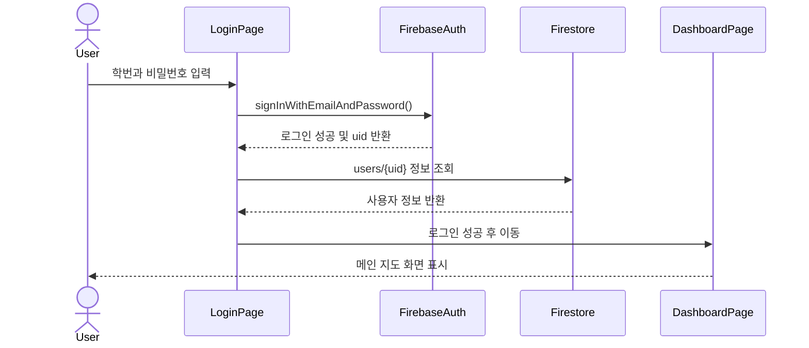
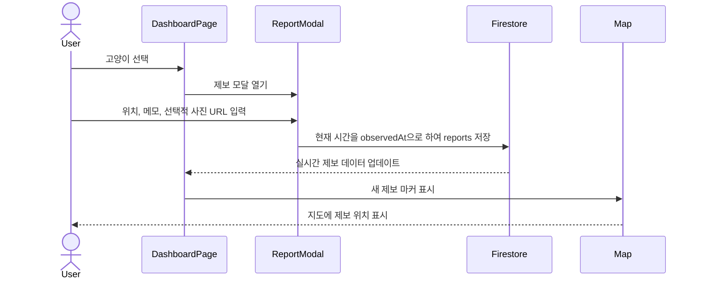
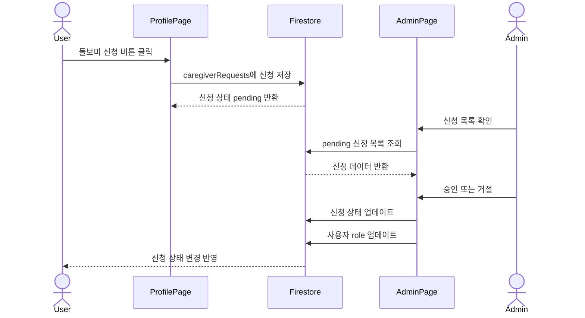
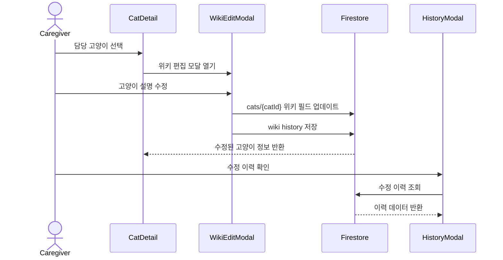
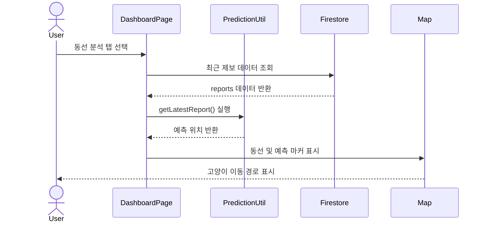
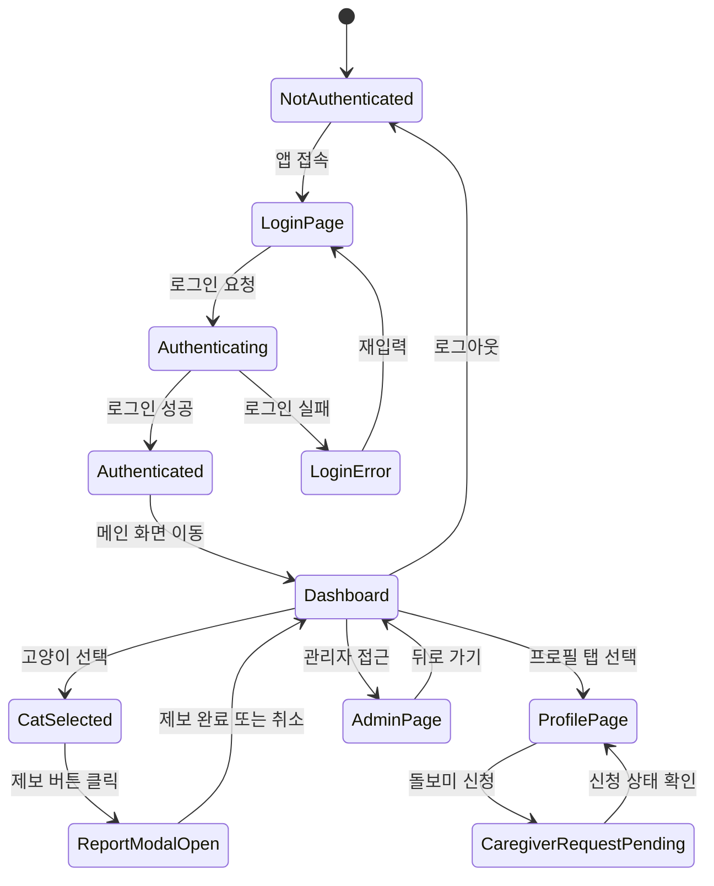
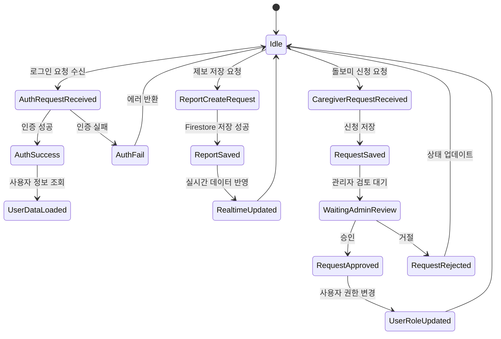

# CCM(Campus Cat Mate)

## -Design-

| Student No | 22411841 |
| --- | --- |
| Name | 박다래 |
| E-Mail | ret7258@naver.com |

---

## Revision History

| Revision date | Version # | Description | Author |
| --- | ---: | --- | --- |
| 06/04/2026 | 1.01 | Initial design document 작성 | 박다래 |
| 06/05/2026 | 1.02 |  배포 구조, 날씨 API, 제보 시간, 데이터 필드 수정 | 박다래 |

---

## Contents

| No. | Section | Description |
| ---: | --- | --- |
| 1 | [Introduction](#1-introduction) | 시스템 개요와 설계 목표 |
| 2 | [Class Diagram](#2-class-diagram) | Domain, Service, Controller 계층과 주요 객체 관계 |
| 3 | [Sequence Diagram](#3-sequence-diagram) | 로그인, 제보, 돌보미 신청, 위키 편집, 동선 분석 흐름 |
| 4 | [State Machine Diagram](#4-state-machine-diagram) | 클라이언트 및 서버 상태 전이 |
| 5 | [Implementation Requirements](#5-implementation-requirements) | 구현 환경, 기능 요구사항, 비기능 요구사항 |
| 6 | [Glossary](#6-glossary) | 주요 용어 정의 |
| 7 | [References](#7-references) | 참고 문서 |

---

# 1. Introduction

본 문서는 CCM(Campus Cat Mate) 시스템의 설계 내용을 설명한다. CCM은 캠퍼스 내 길고양이의 위치, 제보 기록, 급식 여부, 건강 상태, 돌봄 정보를 하나의 서비스에서 관리하기 위한 웹 기반 시스템이다. 본 시스템은 학생들이 일상적으로 남기는 고양이 목격 기록을 유의미한 데이터로 전환하고, 이를 통해 캠퍼스 길고양이와 사람이 보다 안전하고 체계적으로 공존할 수 있는 환경을 제공하는 것을 목표로 한다.

캠퍼스 내 길고양이들은 학업에 지친 학생들에게 정서적 위안을 주는 소중한 존재이다. 많은 학생은 길에서 마주친 고양이의 사진을 찍어 커뮤니티에 공유하거나, 개인적으로 간식을 챙겨주며 고양이와 교감한다. 그러나 이러한 관심은 대부분 개인의 기억, 메신저 대화, SNS 게시글, 단편적인 사진 제보 등에 흩어져 있어 지속적으로 관리되기 어렵다. 특히 고양이의 최근 위치, 자주 머무는 구역, 급식 여부, 건강 이상 징후와 같은 정보는 실시간으로 공유되지 않으면 금방 휘발된다. 이로 인해 같은 고양이에 대한 중복 제보가 발생하거나, 이미 급여가 이루어진 고양이에게 다시 사료가 제공되는 상황이 생길 수 있다. 반대로 건강 이상이 관찰되더라도 관련 정보가 돌보미에게 늦게 전달되어 적절한 대응이 지연될 가능성도 있다.

현재 캠퍼스 고양이 돌봄은 소수의 동아리원, 고양이를 아끼는 학생들, 그리고 익명의 다수 관찰자에 의해 각자 이루어지고 있다. 이 과정에서 특정 고양이에게 사료 급여가 중복되어 비만 위험이 커지거나, 반대로 건강 이상 징후가 발견되어도 정보 공유가 늦어 방치되는 사각지대가 발생할 수 있다. 본 프로젝트는 학생들이 평소처럼 고양이를 발견하고 사진을 남기거나 위치를 제보하는 가벼운 행위가 고양이의 건강과 안전을 지키는 유효한 데이터가 될 수 있다는 생각에서 출발하였다. 사용자가 남긴 짧은 목격 기록들이 모이면 고양이의 최근 위치, 이동 흐름, 자주 머무는 장소를 파악할 수 있고, 돌보미는 이를 바탕으로 더 효율적인 관리와 돌봄을 수행할 수 있다.

CCM은 이러한 문제를 해결하기 위해 지도 기반 제보, 최근 제보 기반 동선 표시, 돌보미 권한 관리, 급여 및 건강 기록, 고양이 위키 편집 기능을 통합하여 제공한다. 일반 학생 사용자는 캠퍼스 고양이를 조회하고 목격 위치를 제보할 수 있으며, 돌보미 사용자는 담당 고양이의 급식 및 건강 상태를 기록하고 위키 정보를 수정할 수 있다. 관리자는 돌보미 신청과 신규 고양이 등록 요청을 승인하거나 거절함으로써 시스템 데이터의 신뢰성을 유지한다.

본 시스템은 단순히 고양이 정보를 저장하는 데 그치지 않고, 여러 사용자가 남긴 제보 데이터를 시간순으로 연결하여 고양이의 이동 흐름을 시각적으로 확인할 수 있도록 설계되었다. 또한 날씨 정보를 함께 제공하여 비가 오는 상황에서 쉼터 정보를 확인할 수 있도록 하며, 캠퍼스 길고양이와 사람이 보다 안전하고 건강하게 공존할 수 있는 환경을 지원한다. CCM의 주 사용자는 캠퍼스에서 고양이를 마주칠 때마다 사진이나 위치를 남기고 싶어 하는 재학생 및 교직원이며, 주기적으로 사료를 챙기고 건강 상태를 모니터링하는 학생 돌보미와 돌봄 동아리도 핵심 사용자층에 해당한다. 나아가 캠퍼스 주변에서 고양이를 발견하는 지역 주민까지 참여할 수 있도록 확장 가능성을 가진다.

본 시스템의 주요 설계 포인트는 다음과 같다.

- Domain, Service, Controller 역할을 분리하여 시스템의 책임 구조를 명확히 하고 유지보수성을 높인다.
- 실제 UI 구현에서는 React 컴포넌트 구조를 활용하여 화면 단위 기능을 분리한다.
- 사용자 역할을 일반 학생, 돌보미, 관리자로 구분한다.
- 지도 기반 UI를 통해 고양이 위치와 제보 데이터를 시각적으로 확인한다.
- Firebase Authentication을 이용하여 로그인 및 회원가입을 처리한다.
- Firestore를 이용하여 고양이, 제보, 사용자, 돌보미 신청 데이터를 저장한다.
- 최근 제보 데이터를 기반으로 고양이의 동선을 표시한다.
- Vercel Serverless Function(`/api/weather`)을 통해 OpenWeather 정보를 조회하고, 쉼터 정보를 함께 제공하여 고양이 돌봄에 필요한 정보를 보조한다.

## 1.1 Use Case Mapping

| Use Case ID | Use Case Name | Primary Actor | Related Design Element |
| --- | --- | --- | --- |
| UC-01 | Login / Signup | Student, Caregiver, Admin | AuthController, AuthService, UserService, User, Firebase Authentication |
| UC-02 | Real-time Map View | All users | MapController, CatService, ReportService, ShelterService, PredictionService, Kakao Map SDK |
| UC-03 | Encounter Report | Student, Caregiver | ReportController, ReportService, Report, current-time `observedAt` |
| UC-04 | New Cat Registration Request | Student, Caregiver | ReportController, CatRegistrationService, CatRegistrationRequest |
| UC-05 | Caregiver Application | Student, Caregiver | CaregiverController, CaregiverRequestService, CaregiverRequest |
| UC-06 | Caregiver Approval | Admin | AdminController, UserService, CaregiverRequestService, User |
| UC-07 | Diet & Health Record | Caregiver | DietLogController, DietLogService, DietLog |
| UC-08 | Wiki Edit | Caregiver | WikiController, WikiService, CatService, WikiHistory |
| UC-09 | History View | All users | CatController, ReportService, DietLogService, WikiService |
| UC-10 | Path Analysis | Student, Caregiver | MapController, PredictionService, ReportService, PredictionResult |
| UC-11 | Admin Data Management | Admin | AdminController, UserService, CatService, CatRegistrationService |

---

# 2. Class Diagram

본 프로젝트의 클래스 다이어그램은 객체지향 설계 관점에서 Domain, Service, Controller 계층으로 나누어 작성하였다. Domain 계층은 `User`, `Cat`, `Report`, `DietLog`와 같은 핵심 데이터 객체를 표현한다. Service 계층은 각 도메인 객체에 대한 생성, 조회, 수정, 삭제 기능과 비즈니스 로직을 담당한다. Controller 계층은 사용자의 요청을 받아 적절한 Service를 호출하고 결과를 화면에 전달하는 역할을 수행한다.

실제 구현에서는 React 함수형 컴포넌트를 사용하지만, 설계 문서에서는 객체지향 구조를 명확히 보이기 위해 UI 컴포넌트가 아닌 시스템의 핵심 객체와 책임 분리를 중심으로 클래스 다이어그램을 작성하였다.

## 2.1 Domain Model Class Diagram

Figure 2.1은 CCM 시스템의 주요 도메인 모델을 나타낸다. `User`는 `Student`, `Caregiver`, `Admin`으로 확장되며, 각 사용자 유형은 시스템에서 수행하는 역할이 다르다. `Student`는 고양이 목격 제보와 신규 고양이 등록 요청을 수행하고, `Caregiver`는 담당 고양이에 대한 급여 및 건강 기록과 위키 수정을 수행한다. `Admin`은 돌보미 신청과 신규 고양이 등록 요청을 승인하거나 거절한다.

`Cat`은 시스템의 핵심 관리 대상이며, `Report`, `DietLog`, `WikiHistory`와 연결된다. `Report`는 목격 제보, `DietLog`는 급여 및 건강 기록, `WikiHistory`는 고양이 정보 수정 이력을 의미한다. 또한 `Weather`, `Shelter`, `PredictionResult`는 날씨와 보호 장소 정보를 바탕으로 고양이의 예상 위치를 계산하는 데 사용된다.

## 2.2 Service Class Diagram

FFigure 2.2는 CCM 시스템의 Service 계층과 Domain 계층, 외부 데이터 소스 간의 관계를 나타낸다. 각 Service 클래스는 특정 도메인 모델의 생성, 조회, 수정, 삭제 기능과 비즈니스 로직을 담당한다. 개별 Domain Model의 속성과 메서드는 Class Diagram 1에서 상세히 제시하였기 때문에, 본 다이어그램에서는 서비스의 책임과 의존 관계를 중심으로 보기 위해 관련 도메인 클래스를 `UserDomain`, `CatDomain`, `ActivityDomain`, `RequestDomain`, `PredictionDomain`과 같은 그룹 단위로 축약하여 표현하였다.

`AuthService`는 로그인과 회원가입을 처리하고, `UserService`는 사용자 정보와 권한을 관리한다. `CatService`는 고양이 정보를 관리하며, `ReportService`는 목격 제보 데이터를 처리한다. `DietLogService`와 `WikiService`는 돌보미가 작성하는 급여·건강 기록과 위키 수정 이력을 관리한다. `CaregiverRequestService`와 `CatRegistrationService`는 각각 돌보미 신청과 신규 고양이 등록 요청을 처리한다. `PredictionService`는 `Report`, `Shelter`, `Weather` 데이터를 이용하여 고양이의 예상 위치를 계산한다. 각 서비스는 Firestore 또는 외부 API에 직접 접근하며, Controller가 데이터 저장소에 직접 접근하지 않도록 책임을 분리하였다.

## 2.3 Controller-Service-Domain Class Diagram

Figure 2.3은 Controller, Service, Domain 계층 간의 관계를 나타낸다. Controller 계층은 사용자의 요청을 받아 적절한 Service를 호출하는 역할을 수행한다. Service 계층은 실제 비즈니스 로직과 데이터 처리 기능을 담당하며, Domain 계층은 시스템에서 사용되는 핵심 데이터 객체를 표현한다.

`AuthController`는 로그인과 회원가입을 처리하고, `CatController`는 고양이 조회, 위키 수정, 예상 위치 조회를 담당한다. `ReportController`는 목격 제보와 신규 고양이 등록 요청을 처리한다. `CaregiverController`와 `AdminController`는 각각 돌보미 신청, 모드 전환, 관리자 승인 기능을 담당한다. `MapController`는 지도 화면에 필요한 고양이 위치, 제보, 보호소, 날씨, 예상 위치 데이터를 통합하여 제공한다.

이 구조는 Controller가 직접 데이터 모델을 조작하지 않고 Service를 통해 접근하도록 설계하여, 각 계층의 책임을 명확히 분리한다.

## 2.4 Class Description

데이터 객체의 `get...()` operation은 해당 속성을 조회하는 접근자이고, `set...()` operation은 해당 속성을 변경하는 수정자이다. 현재 React/Firebase 구현에서는 실제 JavaScript class 인스턴스보다 Firestore 문서 객체를 주로 사용하지만, getter/setter는 데이터 모델이 제공해야 하는 접근 및 변경 책임을 설계 수준에서 표현한 것이다.

### Domain Classes

| Class | Responsibility | Main Attributes | Main Methods |
| --- | --- | --- | --- |
| User | 시스템 사용자의 기본 정보를 저장하고 역할을 관리한다. | uid, studentId, phone, email, nickname, department, role, createdAt | getUid(), getRole(), setRole() |
| Student | 일반 학생 사용자의 제보, 신규 고양이 등록 요청, 돌보미 신청 책임을 가진다. | User로부터 상속 | createReport(), requestCatRegistration(), applyCaregiver() |
| Caregiver | 담당 고양이에 대한 돌봄 기록과 위키 수정 책임을 가진다. | activeMode, caregiverCatIds | createDietLog(), editCatWiki(), setCaregiverCatIds() |
| Admin | 사용자 권한과 요청 승인/거절을 관리한다. | User로부터 상속 | approveCaregiverRequest(), approveCatRegistration(), changeUserRole() |
| Cat | 캠퍼스 고양이의 기본 정보와 상태를 관리한다. | id, name, gender, imageUrl, healthStatus, territory, lat, lng, status | getName(), getLat(), getLng(), setHealthStatus(), setStatus() |
| Report | 사용자가 등록한 고양이 위치 제보 정보를 저장한다. | id, catId, lat, lng, memo, imageUrl, reporterUid, observedAt | getCatId(), getLat(), getLng(), setObservedAt() |
| DietLog | 돌보미가 작성한 급여 및 건강 기록을 저장한다. | id, catId, caregiverUid, foodType, amount, symptoms, memo, fedAt | getFoodType(), getAmount(), setSymptoms(), setMemo() |
| WikiHistory | 고양이 위키 정보 수정 이력을 저장한다. | id, catId, editorUid, origin, feature, healthStatus, territory, editedAt | getEditedAt(), setOrigin(), setHealthStatus() |
| CaregiverRequest | 일반 사용자의 돌보미 권한 신청 정보를 관리한다. | id, uid, catIds, reason, authCode, status, createdAt | getStatus(), setStatus(), setReason() |
| CatRegistrationRequest | 신규 고양이 등록 요청 정보를 임시 저장하고 승인 상태를 관리한다. | id, tempName, gender, description, requesterUid, lat, lng, status | getTempName(), getStatus(), setStatus() |
| Shelter | 고양이 쉼터 위치 정보를 관리한다. | id, name, lat, lng, location, description | getName(), getLat(), getLng() |
| Weather | 현재 날씨 정보를 제공한다. | main, description, temperature, isRain | getIsRain(), setIsRain() |
| PredictionResult | 고양이 예상 위치 계산 결과를 저장한다. | catId, predictedLat, predictedLng, latestReport, nearestShelter, reportCount | getPredictedLat(), getPredictedLng(), setReportCount() |

### Controller Classes

| Class | Responsibility | Main Methods |
| --- | --- | --- |
| AuthController | 로그인, 회원가입, 로그아웃 요청을 처리한다. | login(), signup(), logout(), loadCurrentUser() |
| CatController | 고양이 조회, 상세 정보, 위키 수정, 예상 위치 조회를 처리한다. | getCats(), getCatDetail(), updateCatWiki(), getCatPrediction() |
| ReportController | 목격 제보 등록과 신규 고양이 등록 요청을 처리한다. | createReport(), getReports(), requestNewCatRegistration() |
| CaregiverController | 돌보미 신청, 신청 상태 조회, 활동 모드 전환을 처리한다. | applyCaregiver(), getApplicationStatus(), switchMode() |
| DietLogController | 급여 및 건강 기록 생성과 조회를 처리한다. | createDietLog(), getLatestDietLog(), getDietLogsByCat() |
| WikiController | 고양이 위키 수정과 수정 이력 조회를 처리한다. | updateWiki(), getWikiHistory() |
| AdminController | 관리자 승인, 사용자 권한 변경, 고양이 상태 변경을 처리한다. | approveCaregiverRequest(), approveCatRegistration(), changeUserRole(), toggleCatStatus() |
| MapController | 지도 화면에 필요한 위치, 제보, 날씨, 예측 데이터를 통합한다. | loadMapData(), moveToCat(), displayCatRoute(), displayPredictedLocation() |

### Service Classes

| Class | Responsibility | Main Methods |
| --- | --- | --- |
| AuthService | Firebase Authentication을 이용해 인증을 처리한다. | login(), signup(), logout(), getCurrentUser() |
| UserService | 사용자 정보와 권한을 관리한다. | getUser(), updateUser(), changeUserRole(), approveCaregiverUser() |
| CatService | 고양이 데이터의 생성, 조회, 수정, 상태 변경을 처리한다. | getCat(), getAllCats(), updateCat(), updateCatWiki(), createCatFromRegistrationRequest() |
| ReportService | 목격 제보 데이터를 관리한다. | getReports(), getReportsByCatId(), getLatestReport(), createReport() |
| DietLogService | 급여 및 건강 기록 데이터를 관리한다. | getDietLogsByCatId(), getLatestDietLog(), createDietLog() |
| WikiService | 고양이 위키 수정 이력을 관리한다. | getWikiHistories(), createWikiHistory() |
| CaregiverRequestService | 돌보미 신청의 생성, 승인, 거절을 처리한다. | getPendingRequests(), createCaregiverRequest(), approveCaregiverRequest(), rejectCaregiverRequest() |
| CatRegistrationService | 신규 고양이 등록 요청의 생성, 승인, 거절을 처리한다. | getPendingCatRegistrationRequests(), createCatRegistrationRequest(), approveCatRegistrationRequest(), rejectCatRegistrationRequest() |
| ShelterService | 쉼터 데이터 조회와 가장 가까운 쉼터 계산을 처리한다. | getShelters(), getNearestShelter() |
| WeatherService | `/api/weather`와 OpenWeather API를 통해 날씨 정보를 조회한다. | getWeather(), checkRain() |
| PredictionService | 최근 제보, 날씨, 쉼터 정보를 바탕으로 고양이 예상 위치를 계산한다. | predictCatLocation(), getLatestReport(), calculateNearestShelter(), calculateRoutePoints() |

### Implementation Note

실제 React 구현에서는 Controller 역할의 일부가 `DashboardPage`, `AdminPage`, `ProfilePage`와 같은 화면 컴포넌트 내부 이벤트 핸들러로 구현되었다. 또한 데이터 구독과 계산 로직은 `useCats`, `useReports`, `useWeather`, `useCatPrediction`과 같은 custom hook으로 분리하였다. 그러나 설계 문서의 Class Diagram에서는 객체지향 구조를 명확히 표현하기 위해 Controller, Service, Domain 계층으로 추상화하였다.

---

# 3. Sequence Diagram

## 3.1 Login Sequence

### Description

| Item | Description |
| --- | --- |
| Summary | 사용자가 학번 또는 전화번호 기반 계정으로 로그인하고 메인 지도 화면으로 이동하는 흐름 |
| Participants | User, LoginPage, FirebaseAuth, Firestore, DashboardPage |
| Main Flow | LoginPage가 입력값을 학교 이메일 형식으로 변환한 뒤 Firebase Authentication에 인증을 요청하고, 성공 시 Firestore `users/{uid}` 문서를 조회한다. |
| Result | 사용자 역할과 activeMode가 로드되고 DashboardPage가 표시된다. |

## 3.2 Cat Report Sequence

### Description

| Item | Description |
| --- | --- |
| Summary | 사용자가 고양이 목격 위치를 제보하고 지도에 실시간으로 반영하는 흐름 |
| Participants | User, DashboardPage, ReportModal, Firestore, Map |
| Main Flow | 사용자가 지도에서 위치를 선택하고 고양이, 메모, 선택적 사진 URL을 입력하면 `reports` 컬렉션에 저장된다. |
| Result | 저장 시점의 현재 시간이 `observedAt`으로 기록되고, Firestore 실시간 구독을 통해 지도 마커와 최근 제보 정보가 갱신된다. |

## 3.3 Caregiver Request Sequence

### Description

| Item | Description |
| --- | --- |
| Summary | 일반 사용자 또는 기존 돌보미가 하나 이상의 고양이에 대해 돌보미 권한을 신청하고 관리자가 처리하는 흐름 |
| Participants | User, ProfilePage, Firestore, AdminPage, Admin |
| Main Flow | 신청 정보는 `caregiverRequests` 컬렉션에 `pending` 상태로 저장되고, 관리자는 관리자 페이지에서 승인 또는 반려한다. |
| Result | 승인 시 사용자 문서의 `role`이 `caregiver`로 변경되고 `caregiverCatIds`에 담당 고양이 목록이 저장된다. |

## 3.4 Cat Wiki Edit Sequence

### Description

| Item | Description |
| --- | --- |
| Summary | 돌보미가 담당 고양이의 위키 정보를 수정하고 수정 이력을 저장하는 흐름 |
| Participants | Caregiver, CatDetail, WikiEditModal, Firestore, HistoryModal |
| Main Flow | 담당 권한을 확인한 뒤 위키 입력값을 `cats` 문서에 업데이트하고, 수정 내용은 `wikiHistories` 컬렉션에 저장한다. |
| Result | 고양이 상세 카드와 히스토리 모달에서 최신 위키 정보 및 수정 이력을 확인할 수 있다. |

## 3.5 Route Prediction Sequence

### Description

| Item | Description |
| --- | --- |
| Summary | 선택한 고양이의 최근 제보 데이터를 기반으로 동선과 AI 예측 위치를 표시하는 흐름 |
| Participants | User, DashboardPage, PredictionUtil, Firestore, Map |
| Main Flow | DashboardPage가 `reports` 데이터를 사용하여 최근 제보를 정렬하고, prediction utility가 예측 위치와 최신 제보 정보를 계산한다. |
| Result | 지도에 최근 제보 기반 이동 경로, 최신 위치 마커, AI 예측 위치가 표시된다. `observedAt`이 우선 기준이고 기존 데이터는 `createdAt`을 보조 기준으로 사용한다. |

---

# 4. State Machine Diagram

## 4.1 Client State Machine Diagram

### Explanation

클라이언트는 로그인 전 상태에서 시작한다. 사용자가 로그인에 성공하면 대시보드 상태로 전환된다. 대시보드에서는 고양이 선택, 제보 등록, 프로필 확인, 관리자 페이지 접근 등의 상태로 이동할 수 있다. 로그아웃하면 다시 인증되지 않은 상태로 돌아간다.

## 4.2 Server State Machine Diagram

### Explanation

서버는 Firebase Authentication과 Firestore를 중심으로 동작한다. 로그인 요청이 들어오면 인증을 수행하고, 성공 시 사용자 정보를 반환한다. 제보 등록 요청은 Firestore에 저장되고 실시간 구독을 통해 클라이언트에 반영된다. 돌보미 신청은 관리자 검토 상태로 저장되며, 승인 시 사용자 권한이 변경된다.

---

# 5. Implementation Requirements

## 5.1 Operating Environment

| Category | Requirement |
| --- | --- |
| Frontend Framework | React |
| Build Tool | Vite |
| Language | JavaScript, JSX |
| Styling | Tailwind CSS |
| Authentication | Firebase Authentication |
| Database | Cloud Firestore |
| Map API | Kakao Map API |
| Weather API | Vercel `/api/weather`, OpenWeather API |
| Package Manager | npm |
| Runtime Environment | Node.js |
| Browser | Chrome, Safari, Edge 등 최신 브라우저 |
| Deployment | Vercel |

## 5.2 Functional Requirements

| No. | Requirement |
| ---: | --- |
| FR-01 | 사용자는 학번과 비밀번호를 이용하여 로그인할 수 있어야 한다. |
| FR-02 | 사용자는 회원가입 시 학생 또는 돌보미 신청 정보를 입력할 수 있어야 한다. |
| FR-03 | 사용자는 지도에서 캠퍼스 고양이 위치를 확인할 수 있어야 한다. |
| FR-04 | 사용자는 고양이를 선택하여 상세 정보를 확인할 수 있어야 한다. |
| FR-05 | 사용자는 고양이 목격 위치, 메모, 선택적 사진 URL을 제보할 수 있어야 하며, 제보 시간은 현재 시간으로 저장되어야 한다. |
| FR-06 | 시스템은 제보 데이터를 지도 마커로 표시해야 한다. |
| FR-07 | 시스템은 최근 제보 데이터를 기반으로 고양이 동선을 표시해야 한다. |
| FR-08 | 돌보미는 담당 고양이의 설명과 급식 상태를 수정할 수 있어야 한다. |
| FR-09 | 돌보미는 담당 고양이의 급여 및 건강 기록을 작성할 수 있어야 한다. |
| FR-10 | 관리자는 돌보미 신청을 승인 또는 거절할 수 있어야 한다. |
| FR-11 | 관리자는 신규 고양이 등록 요청을 승인 또는 반려할 수 있어야 한다. |
| FR-12 | 시스템은 `/api/weather`를 통해 날씨 정보를 제공하고 비 오는 상황에서 쉼터 정보를 표시할 수 있어야 한다. |

## 5.3 Non-functional Requirements

| No. | Requirement |
| ---: | --- |
| NFR-01 | UI는 모바일 화면에서도 사용하기 쉬워야 한다. |
| NFR-02 | Firestore 실시간 구독을 사용하여 데이터 변경 사항을 빠르게 반영해야 한다. |
| NFR-03 | 사용자 역할에 따라 접근 가능한 기능을 제한해야 한다. |
| NFR-04 | 이미지, 지도 마커, 모달 등 UI 요소는 일관된 디자인을 가져야 한다. |
| NFR-05 | OpenWeather API key는 Vercel 서버 환경 변수로 관리해야 하며, 클라이언트는 `/api/weather`만 호출해야 한다. |
| NFR-06 | 코드 유지보수를 위해 Domain, Service, Controller 역할을 분리하고, 실제 UI 구현에서는 컴포넌트와 커스텀 훅을 분리해야 한다. |

## 5.4 Hardware Requirements

| Category | Requirement |
| --- | --- |
| Client Device | PC, 노트북, 태블릿, 스마트폰 |
| Network | 인터넷 연결 필요 |
| Server | Firebase Cloud Service 및 Vercel Serverless Function 사용 |

## 5.5 Software Requirements

| Category | Requirement |
| --- | --- |
| OS | macOS, Windows, Linux |
| Browser | Chrome, Safari, Edge |
| Editor | Visual Studio Code |
| Version Control | Git, GitHub |
| Library | React Router, Firebase SDK, Lucide React, Tailwind CSS |

---

# 6. Glossary

| Term | Description |
| --- | --- |
| CCM | Campus Cat Mate의 약자로, 캠퍼스 고양이 제보 및 돌봄 관리 시스템을 의미한다. |
| User | 시스템을 사용하는 일반 사용자, 돌보미, 관리자를 포함한다. |
| Student | 일반 학생 사용자로, 고양이 조회 및 제보 기능을 사용할 수 있다. |
| Caregiver | 고양이를 관리하는 돌보미 사용자로, 담당 고양이의 정보 수정 권한을 가진다. |
| Admin | 시스템 관리자로, 돌보미 신청 승인 및 사용자 관리를 수행한다. |
| Cat | 캠퍼스 내에서 관리 대상이 되는 고양이 객체이다. |
| Report | 사용자가 등록한 고양이 목격 제보 데이터이다. 위치, 메모, 선택적 사진 URL, 저장 시점의 현재 시간(`observedAt`)을 포함한다. |
| DietLog | 돌보미가 작성한 고양이 급여 및 건강 기록 데이터이다. |
| WikiHistory | 고양이 위키 정보가 수정될 때 이전 내용과 수정 내용을 저장하는 이력 데이터이다. |
| CatRegistrationRequest | 신규 고양이 등록 요청을 임시 저장하고 관리자 승인 상태를 관리하는 데이터이다. |
| Shelter | 고양이가 비나 위험 상황을 피할 수 있는 쉼터 위치 정보이다. |
| Firebase Authentication | 사용자 로그인 및 회원가입 인증을 처리하는 Firebase 서비스이다. |
| Firestore | Firebase에서 제공하는 NoSQL 클라우드 데이터베이스이다. |
| Collection | Firestore에서 문서들을 그룹화하는 단위이다. |
| Document | Firestore에서 실제 데이터가 저장되는 단위이다. |
| Kakao Map API | 지도 표시 및 위치 기반 기능을 제공하는 API이다. |
| Vercel Serverless Function | `/api/weather`처럼 클라이언트가 직접 외부 API key를 노출하지 않도록 서버 측에서 요청을 중계하는 배포 환경 기능이다. |
| Marker | 지도 위에 특정 위치를 표시하는 아이콘이다. |
| Route Prediction | 최근 제보 데이터를 기반으로 고양이 이동 경로를 예측하거나 시각화하는 기능이다. |
| Wiki | 고양이의 설명이나 특징을 사용자가 확인하고 돌보미가 수정할 수 있는 정보 영역이다. |
| Revision History | 문서 또는 데이터가 수정된 이력을 기록한 정보이다. |
| Modal | 화면 위에 팝업 형태로 나타나는 UI 컴포넌트이다. |
| Active Mode | 사용자가 현재 사용 중인 모드로, student 또는 caregiver 모드가 있다. |
| Domain Model | 시스템에서 관리하는 핵심 데이터 객체로, User, Cat, Report, DietLog 등이 해당한다. |
| Service | 도메인 객체에 대한 생성, 조회, 수정, 삭제 및 비즈니스 로직을 담당하는 계층이다. |
| Controller | 사용자의 요청을 받아 적절한 Service를 호출하고 결과를 화면에 전달하는 계층이다. |
| PredictionResult | 최근 제보, 날씨, 쉼터 정보를 바탕으로 계산된 고양이 예상 위치 결과 객체이다. |

---

# 7. References

| No. | Reference |
| ---: | --- |
| 1 | React 공식 문서 |
| 2 | Firebase Authentication 공식 문서 |
| 3 | Cloud Firestore 공식 문서 |
| 4 | Vite 공식 문서 |
| 5 | Tailwind CSS 공식 문서 |
| 6 | Kakao Maps API 공식 문서 |
| 7 | Vercel Serverless Functions 공식 문서 |
| 8 | OpenWeather API 공식 문서 |
